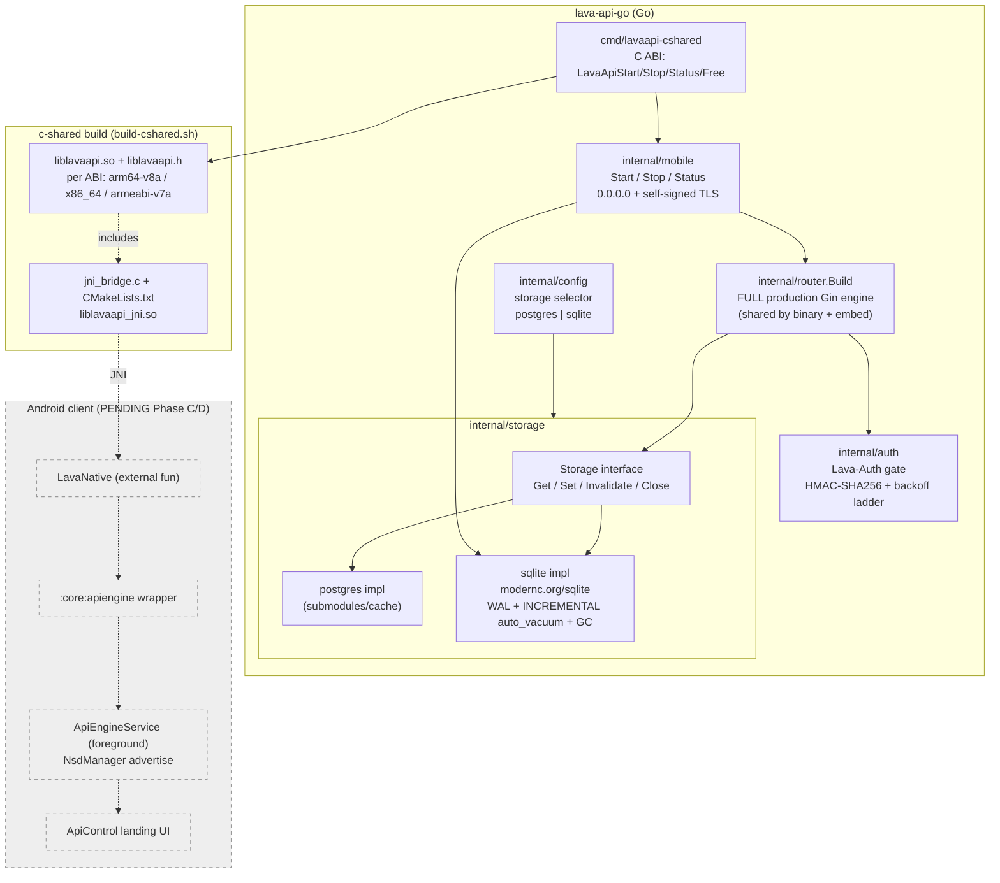
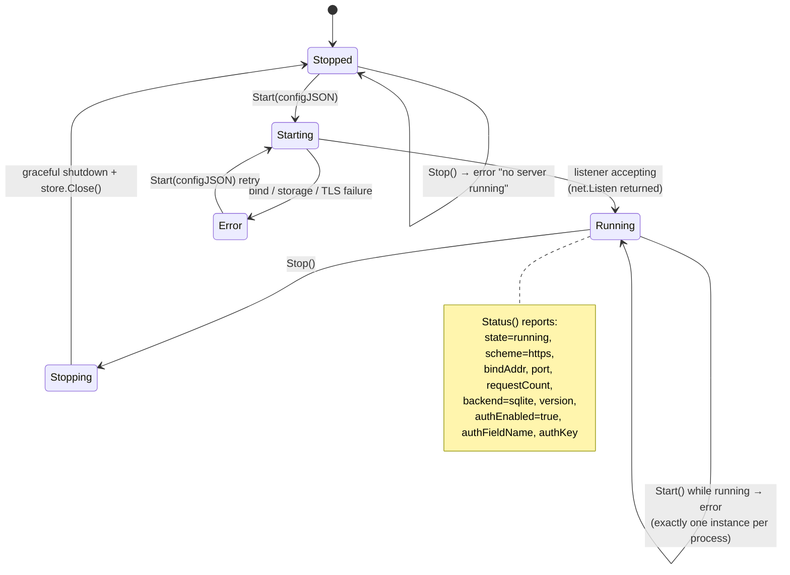
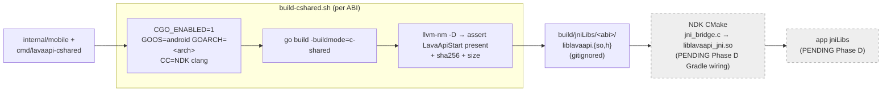

# On-Device Lava API (Android)

> **Status of this document (2026-06-02):** Phases A and B of the
> *Lava API Android app* sub-project (spec
> [`docs/superpowers/specs/2026-06-02-lava-api-android-app-design.md`](superpowers/specs/2026-06-02-lava-api-android-app-design.md),
> plan [`docs/superpowers/plans/2026-06-02-lava-api-android-app.md`](superpowers/plans/2026-06-02-lava-api-android-app.md))
> have landed. This document describes **only what the committed code does** —
> the additive SQLite storage backend (Phase A) and the in-process Go embed +
> c-shared/JNI native build (Phase B). The Android app module (`:api-app`), the
> `:core:apiengine` Kotlin wrapper, the foreground `ApiEngineService`, the
> `NsdManager` advertisement, and the landing UI are **PENDING (Phases C/D/E)**
> and are explicitly marked as such below. Nothing in this doc describes
> behavior that is not yet in the tree.
>
> `Classification:` project-specific (the on-device-API app + Go SQLite backend
> are Lava-specific; the additive-backend-selector pattern is universal and is
> noted as such inline).

## 1. Motivation

The existing Lava API (`lava-api-go`) runs on a host (server, NAS, or developer
workstation) backed by Postgres, advertises itself on the LAN via mDNS, and the
Android client discovers and talks to it over HTTPS. The on-device API
sub-project lets a **phone or tablet itself become a LAN-reachable Lava API**:
the same Go server, cross-compiled and embedded in-process, backed by a local
SQLite file, bound to `0.0.0.0` so other devices on the same Wi-Fi can discover
and use it.

The design constraint the operator set is *additive*: "Nothing already working
can be broken — only extended for more flexibility." Every existing Postgres
deployment behaves byte-for-byte as before; SQLite and the embed are new,
config-selected branches.

## 2. The additive SQLite storage backend (Phase A — landed)

### 2.1 Principle (universal pattern)

A **backend selector** whose default reproduces today's behavior exactly. The
existing code becomes "the Postgres branch," never "the only path." Any
deployment that sets `LAVA_API_PG_URL` and nothing else behaves identically to
before.

`Classification:` the selector pattern itself is universal; the two concrete
backends are Lava-specific.

### 2.2 Config selection

Source: [`lava-api-go/internal/config/config.go`](../lava-api-go/internal/config/config.go).

| Variable | Meaning | Required when |
|---|---|---|
| `LAVA_API_STORAGE_BACKEND` | `postgres` (default) or `sqlite` | never (defaults to `postgres`) |
| `LAVA_API_PG_URL` | Postgres connection URL | iff backend is `postgres` |
| `LAVA_API_SQLITE_PATH` | SQLite database file path (e.g. `/data/lava-api.db`; `:memory:` accepted) | iff backend is `sqlite` |

`config.Load()` selects the branch in a `switch cfg.StorageBackend`:

- `postgres` → require `PGUrl` (the historical hard dependency, now scoped to
  this branch so existing users are unaffected).
- `sqlite` → require `SQLitePath`.
- anything else → reject with `unknown storage backend %q`.

No env var was renamed or removed; the two new variables carry placeholders in
`.env.example` (§6.R). `LAVA_API_TLS_CERT`/`LAVA_API_TLS_KEY` and a valid
`LAVA_API_MDNS_PORT` remain required regardless of backend.

### 2.3 Storage boundary and parity with Postgres

Source: [`lava-api-go/internal/storage/`](../lava-api-go/internal/storage/).

The `storage.Storage` interface
([`storage.go`](../lava-api-go/internal/storage/storage.go)) declares **exactly**
the cache operations the handlers depend on — enumerated from the real handler
consumers, nothing more:

```go
type Storage interface {
    Get(ctx context.Context, key string) ([]byte, cache.Outcome, error)
    Set(ctx context.Context, key string, value []byte, ttl time.Duration) error
    Invalidate(ctx context.Context, key string) error
    Close() error
}
```

Two implementations satisfy it interchangeably:

- **postgres** — wraps the existing `submodules/cache/pkg/postgres` adapter
  (`response_cache` table, schema `lava_api`, 10-minute GC interval). Behavior
  is unchanged from the prior `main.go` path.
- **sqlite** — pure-Go [`modernc.org/sqlite`](https://pkg.go.dev/modernc.org/sqlite)
  (CGo-free, so it cross-compiles cleanly for Android). Behavior parity with
  Postgres is the explicit goal and is verified by a shared conformance
  harness plus a cross-backend parity test (per the plan).

`storage.New(cfg)` ([`factory.go`](../lava-api-go/internal/storage/factory.go))
selects the implementation by `cfg.StorageBackend` and returns the `Storage`
together with a `ReadinessFunc` (the `/ready` probe): Postgres uses
`pgClient.HealthCheck`; SQLite does a trivial round-trip `Get` of a sentinel key
to prove the handle answers queries.

### 2.4 SQLite TTL, GC, and WAL semantics

Source: [`sqlite.go`](../lava-api-go/internal/storage/sqlite.go),
migration [`migrations/sqlite/0001_init.sql`](../lava-api-go/internal/migrations/sqlite/0001_init.sql).

Schema mirrors the Postgres `response_cache` table with portable types:

```sql
CREATE TABLE IF NOT EXISTS response_cache (
    cache_key   TEXT PRIMARY KEY,
    value       BLOB NOT NULL,        -- BYTEA equivalent
    expires_at  INTEGER               -- unix NANOSECONDS; NULL = never expires
);
CREATE INDEX IF NOT EXISTS response_cache_expires_at_idx ON response_cache (expires_at);
```

Behavioral details the committed code implements:

- **TTL** is an absolute `expires_at` (unix nanoseconds). `Set` with `ttl > 0`
  stores `now + ttl`; `ttl <= 0` stores SQL `NULL` (never expires) — matching
  the Postgres `WHERE expires_at IS NULL OR expires_at > NOW()` contract.
- **Lazy expiry on read.** `Get` filters `expires_at IS NULL OR expires_at > ?`,
  so an expired entry reads as an `OutcomeMiss`, never a stale hit. A real DB
  error returns `OutcomeBypass + err` so callers fall through to the upstream —
  identical to `cache.Client.Get`. A stored zero-length value is a **hit**
  (non-nil empty slice), matching Postgres `BYTEA` empty-value semantics.
- **Background GC.** A goroutine runs `sweepExpired` every **10 minutes**
  (`sqliteGCInterval`, mirroring the Postgres GC cadence). It physically
  `DELETE`s rows whose `expires_at` is in the past and then runs
  `PRAGMA incremental_vacuum` to return freed pages to the free list. `Close()`
  cancels the goroutine's context and joins it (no leak); `Close()` is
  idempotent.
- **WAL + auto_vacuum** (on-disk databases only; skipped for `:memory:`):
  - The DSN sets `journal_mode(WAL)` (concurrent readers don't block the single
    writer) and `busy_timeout(5000)` (ride out brief write locks).
  - `SetMaxOpenConns(1)` serializes access through one connection — the
    standard race-free choice for an embedded SQLite writer, and required so the
    connection-scoped `auto_vacuum` PRAGMA applies to the one connection every
    query uses.
  - `PRAGMA auto_vacuum=INCREMENTAL` followed by `VACUUM` is run **before** the
    migration (the VACUUM rewrites the DB header with the new flag; order is
    load-bearing — running the PRAGMA after a table exists leaves
    `auto_vacuum=0`).
  - After migration, `PRAGMA journal_mode` is re-queried and the constructor
    **fails loudly** if WAL did not engage, refusing to run in a weaker
    (DELETE) journal mode that would drop the concurrent-reader guarantee.

## 3. The in-process Go embed (Phase B — landed)

Source: [`lava-api-go/internal/mobile/mobile.go`](../lava-api-go/internal/mobile/mobile.go)
and [`tls.go`](../lava-api-go/internal/mobile/tls.go).

`internal/mobile` is the small, JNI-friendly lifecycle surface that boots the
**full production API in-process** inside the Android app (Phases C/D will call
it). Three exported functions, designed so only `string`/`error` cross the
boundary:

```go
func Start(configJSON string) error  // parse config → SQLite + full router + TLS, listen, return when accepting
func Stop()  error                   // graceful shutdown + close storage; errors if nothing running
func Status() string                 // JSON: state, scheme, bindAddr, port, requestCount, backend, version, auth*
```

`Start`'s `configJSON` shape:
`{"bindAddr":"0.0.0.0","port":8443,"sqlitePath":"/data/x.db","authSharedKey":"<base64-uuid>","authFieldName":"<header>"}`
— `bindAddr`/`port` optional (default `0.0.0.0:8443`); `sqlitePath` required;
`authSharedKey`/`authFieldName` optional (see §3.4). Exactly one server instance
may run per process (a package-level handle guarded by a mutex; `Start` while
running returns an error).

### 3.1 Why c-shared, not gomobile

Source: [`lava-api-go/cmd/lavaapi-cshared/main.go`](../lava-api-go/cmd/lavaapi-cshared/main.go).

`gomobile bind` is **BLOCKED** on this module. `lava-api-go`'s `go.mod` uses
relative `replace ../submodules/*` directives for the 16 vasic-digital
submodules; gomobile's overlay-module generator cannot resolve them (it writes a
0-byte `go.mod`; proven on NDK 21.4 + 25.1). The chosen replacement is
**`go build -buildmode=c-shared`**, which uses ordinary Go module resolution and
therefore HONORS the replace directives. It is still an in-process,
cross-compiled Go artifact.

The tradeoff: c-shared exports a flat C ABI, not a generated Java class
hierarchy. A **hand-written JNI bridge** adapts the four exported C functions to
the JNI naming convention the Kotlin side will bind.

The exported C surface (all strings NUL-terminated UTF-8; every returned
`char*` is heap-allocated by `C.CString` and the caller MUST release it via
`LavaApiFree`):

```c
extern char* LavaApiStart(char* configJSON);  // "" on success, else error msg
extern char* LavaApiStop(void);                // "" on success, else error msg
extern char* LavaApiStatus(void);              // status JSON document
extern void  LavaApiFree(char* p);             // free a returned string
```

### 3.2 The JNI contract

Source: [`lava-api-go/cmd/lavaapi-cshared/jni/jni_bridge.c`](../lava-api-go/cmd/lavaapi-cshared/jni/jni_bridge.c)
and [`CMakeLists.txt`](../lava-api-go/cmd/lavaapi-cshared/jni/CMakeLists.txt).

`jni_bridge.c` builds `liblavaapi_jni.so`, which links against the prebuilt
`liblavaapi.so` (from the c-shared build) and exposes the entry points the
Kotlin side will bind:

```kotlin
package digital.vasic.lava.apigo

object LavaNative {
    external fun nativeStart(configJson: String): String  // "" on success, else error message
    external fun nativeStop(): String                      // "" on success, else error message
    external fun nativeStatus(): String                    // status JSON document
}
```

JNI symbol names (package dots → underscores, then class, then method):

- `Java_digital_vasic_lava_apigo_LavaNative_nativeStart`
- `Java_digital_vasic_lava_apigo_LavaNative_nativeStop`
- `Java_digital_vasic_lava_apigo_LavaNative_nativeStatus`

A Kotlin `object` compiles to a final class with a static `INSTANCE`; its
`external` functions register as native methods that receive a `jclass`, so the
bridge functions take `(JNIEnv*, jclass, ...)`. The bridge copies each
Go-returned C string into a JVM string via `NewStringUTF` and immediately
releases the C buffer via `LavaApiFree` so nothing leaks across the boundary.

`jni_bridge.c` and its `CMakeLists.txt` live in the `jni/` **subdirectory**, NOT
the cgo `main` package, because `jni_bridge.c` `#include`s `liblavaapi.h` — the
cgo-*generated* header the c-shared build PRODUCES — so it cannot be compiled by
the cgo build itself; it is compiled later by the Android NDK toolchain via
`externalNativeBuild { cmake { ... } }`.

> **PENDING (Phase C):** the Kotlin `LavaNative` object, the `:core:apiengine`
> wrapper module, and the `externalNativeBuild` Gradle wiring that loads these
> native libraries do not exist in the tree yet. The contract above is what
> Phase C MUST match; it is documented here because the C/JNI side that defines
> it has landed.

### 3.3 What the embed serves (full production router) + TLS

The embed builds the **EXACT same Gin engine** the production `cmd/lava-api-go`
binary builds, via the shared `internal/router.Build` constructor
([`router.go`](../lava-api-go/internal/router/router.go)) — search / browse /
topic / forum / torrent / login / favorites / captcha, `/v1/{provider}/...`,
plus `/health` and `/ready`. The provider registry wires the same adapters
production wires (rutracker, nnmclub, kinozal, archive.org, gutenberg). Sharing
one router constructor is deliberate (§6.J): a divergent embed router would be a
bluff vector — green tests against an embed serving different routes than
production would guarantee nothing about production.

The **only** transport difference from the LAN binary: the embed serves
HTTP/1.1 + HTTP/2 over TLS using a standard `net/http` server; the binary
additionally serves HTTP/3 (QUIC). HTTP/3 is not required for the embed — LAN
clients that discover the on-device API speak ordinary HTTPS. The embed
explicitly disables Brotli / protocol-metric / AltSvc middlewares (transport
tuning, not security) so repeated in-process `Start`/`Stop` cycles don't touch
the Prometheus default registerer.

**TLS** ([`tls.go`](../lava-api-go/internal/mobile/tls.go)):

- A self-signed **ECDSA P-256** cert + key is generated on first boot and
  persisted next to the SQLite DB (`lava-embed-cert.pem` / `lava-embed-key.pem`;
  the key is written `0600`). Validity is 10 years (rotation handling is a later
  sub-project).
- If both files already exist and parse, they are **reused** across restarts, so
  a peer that pinned the leaf cert out-of-band does not see it change every boot.
- **IP SANs:** loopback (IPv4 + IPv6) plus the host's non-loopback,
  non-link-local LAN IPs discovered at boot (`localIPs()`), so a peer addressing
  the server by LAN IP does not hit a host-mismatch error.
- **No wildcard DNS SAN.** DNS SANs are limited to `localhost` — a bare `*`
  wildcard SAN matched ANY hostname and defeated name verification (a
  security-review finding; fixed in commit `6f751495`). Peers address the embed
  by LAN IP (covered by the IP SANs) or by `localhost` on-device. Out-of-band
  leaf trust on the consuming devices is the model for now (full client-trust /
  local-CA handling is a later sub-project).

### 3.4 The Lava-Auth gate on the embed (same mechanism as the host)

Because the embed is network-exposed (§3.5), it **MUST authenticate** — there is
no "trusted LAN" shortcut. It enforces the **identical** Lava-Auth gate the
production LAN binary uses (`internal/auth.NewMiddleware` +
`NewBackoffMiddleware`, source
[`middleware.go`](../lava-api-go/internal/auth/middleware.go)):

- The client presents a credential in a configurable header (default
  `Lava-Auth`). The credential is `base64(16-byte UUID blob)`.
- The middleware base64-decodes the header, computes
  `hex(HMAC-SHA256(uuid_bytes, secret))`, and compares (in constant time, to
  defeat timing side-channels) against the active-clients allowlist.
- Active hash → request served (`client_name` set, backoff reset). Retired hash
  → 426 Upgrade Required. Missing / malformed / unknown → 401 and the per-IP
  backoff ladder advances; repeated failures escalate to 429 on the default
  ladder `2s,5s,10s,30s,1m,1h`.
- `/health` and `/ready` are registered **before** the auth middleware so the
  orchestrator probes work without a credential.

The embed's app-managed key flow:

- The host app supplies the credential via `authSharedKey` in the Start config.
- **If none is supplied, the embed GENERATES one** (random 16-byte UUID,
  base64-encoded) so the gate is never disabled. The generated/in-effect key is
  surfaced via `Status()` (the `authKey` field) — and **only** there — so the
  app can display it for pairing. It is deliberately never written to a log line
  (§6.H / §6.AC redaction). The plaintext blob is zeroized after hashing.
- `Status().authEnabled` is always `true` while running.

> **PENDING (Phase D):** persisting the key across app restarts and the UI that
> shows it for pairing are the Android app's responsibility. This surface only
> ENFORCES whatever key is in effect and reports it.

### 3.5 Network exposure (0.0.0.0) and the trust boundary

The embed binds **`0.0.0.0`** by default — network exposure is the intended
design. Loopback-only would defeat the feature (the whole point is that a phone
running the embed becomes a LAN-reachable Lava API for tablets, TVs, and other
phones). The bind address is validated with `net.ParseIP`; non-loopback
(including the `0.0.0.0` wildcard) is explicitly allowed, and only
unparseable IPs are rejected. The automated security-review suggestion of
loopback-only was therefore explicitly overridden in the code, with the Lava-Auth
gate (§3.4) as the compensating control: anyone on the LAN can *reach* the port,
but only a holder of the auth key gets a non-401 response.

### 3.6 mDNS identity (Android instance vs host instance)

The embed is honestly the Go engine on Android with SQLite, so it will advertise:

- Service type `_lava-api._tcp` (release) / `_lava-api-dev._tcp` (debug) — the
  same types the client already watches (catalog in
  [`core/data/.../DiscoveryServiceTypes.kt`](../core/data/src/main/kotlin/lava/data/api/service/DiscoveryServiceTypes.kt):
  `SERVICE_TYPE_GO = "_lava-api._tcp"`, `SERVICE_TYPE_GO_DEV = "_lava-api-dev._tcp"`,
  `SERVICE_TYPE_KTOR = "_lava._tcp"`).
- TXT: `engine=go`, **`platform=android`**, `storage=sqlite`, `version=<n>`.

The existing host instance keeps advertising `engine=go` with
`platform=server` (or absent) — unchanged; both appear in the client's list. The
"distinct identity" is realized via the `platform` TXT key, which the client
(sub-project 2) will label distinctly without any discovery re-architecture.
Instances without `platform` render exactly as today (backward compatible).

> **PENDING (Phase D):** the on-device `NsdManager` *registration* (the embed
> advertising itself) is not yet in the tree. The client-side *discovery* that
> consumes these TXT records already exists in
> [`LocalNetworkDiscoveryServiceImpl`](../core/data/src/main/kotlin/lava/data/impl/service/LocalNetworkDiscoveryServiceImpl.kt)
> and is described in [`LOCAL_NETWORK_DISCOVERY.md`](LOCAL_NETWORK_DISCOVERY.md).

## 4. Diagrams

### 4.1 Component / module diagram (what has landed)



### 4.2 Start / Stop / Restart lifecycle state machine



> The `Starting`/`Stopping` intermediate states above are the **conceptual**
> lifecycle the Android UI (Phase D) will render. The Go embed itself exposes
> only `Stopped` and `Running` via `Status().state` today; the UI-facing
> transient states are PENDING Phase D.

### 4.3 mDNS discovery + authenticated request sequence

```mermaid
sequenceDiagram
    participant P as Phone running embed<br/>(PENDING Phase D advertiser)
    participant N as LAN (mDNS / multicast)
    participant C as Other Lava client

    P->>P: Start embed (0.0.0.0:8443, SQLite, self-signed TLS)
    P->>P: generate-or-use Lava-Auth key (Status.authKey)
    Note over P,N: PENDING Phase D — NsdManager.registerService
    P->>N: advertise _lava-api._tcp<br/>TXT engine=go, platform=android, storage=sqlite, version=n
    C->>N: NsdManager discover _lava-api._tcp (already in-tree)
    N-->>C: resolved host:port + TXT
    C->>C: map to Endpoint.GoApi(host, port)<br/>label platform=android distinctly (PENDING sub-project 2)
    C->>P: HTTPS GET /health (no auth required)
    P-->>C: 200 OK
    C->>P: HTTPS GET /v1/{provider}/search?... (Lava-Auth: <key>)
    P->>P: auth middleware: HMAC-SHA256 vs allowlist (constant-time)
    alt valid key
        P-->>C: 200 + real JSON
    else missing / wrong key
        P-->>C: 401; backoff ladder advances → 429 on repeat
    end
```

### 4.4 Build pipeline (Go → per-ABI .so → jniLibs → app)



## 5. Building the native libraries

See the script guide [`docs/scripts/build-cshared.sh.md`](scripts/build-cshared.sh.md)
for the authoritative reference. In brief:

```bash
cd lava-api-go
./scripts/build-cshared.sh                 # all three ABIs
./scripts/build-cshared.sh arm64-v8a       # just the critical ABI
```

| ABI | `GOARCH` | NDK clang wrapper (API=28 default) |
|---|---|---|
| `arm64-v8a` | `arm64` | `aarch64-linux-android28-clang` |
| `x86_64` | `amd64` | `x86_64-linux-android28-clang` |
| `armeabi-v7a` | `arm` | `armv7a-linux-androideabi28-clang` |

Outputs land in `lava-api-go/build/jniLibs/<abi>/liblavaapi.{so,h}` (gitignored —
only the source is committed). The script prints each `.so`'s size + sha256 and
asserts `LavaApiStart` is in the dynamic symbol table via `llvm-nm`. A missing
NDK toolchain or NDK clang is reported as a hard failure (exit 2 for config
errors, 1 for build/symbol failures) — no `.so` is faked (§6.J / Anti-Bluff).

> **PENDING (Phases C/D/E):** the Android `:api-app` module, the
> `:core:apiengine` wrapper, the foreground service, the on-device mDNS
> advertiser, the landing UI, and the instrumented Challenge tests that boot the
> embed on a real emulator and issue a real HTTPS request are not yet in the
> tree. Until they land, the native libraries above have no Gradle consumer.

## 6. Constitutional alignment (what the landed code already satisfies)

- **§6.R No-Hardcoding** — SQLite path, bind addr, port, header name, and NDK
  path/API level all come from config / env / Start-config, never literals.
- **§6.H Credential Security** — the auth key is surfaced only via `Status()`,
  never logged; plaintext UUID blobs are zeroized after hashing.
- **§6.J Anti-Bluff** — the embed reuses the production router so embed tests
  guarantee production behavior; the build script reports real `.so` evidence.
- **§6.U No sudo/su** — the build uses user-local NDK tooling only.

## 7. References

- Spec: [`docs/superpowers/specs/2026-06-02-lava-api-android-app-design.md`](superpowers/specs/2026-06-02-lava-api-android-app-design.md)
- Plan: [`docs/superpowers/plans/2026-06-02-lava-api-android-app.md`](superpowers/plans/2026-06-02-lava-api-android-app.md)
- Script guide: [`docs/scripts/build-cshared.sh.md`](scripts/build-cshared.sh.md)
- User guide: [`docs/guides/ON_DEVICE_API_USER_GUIDE.md`](guides/ON_DEVICE_API_USER_GUIDE.md)
- Discovery flow: [`docs/LOCAL_NETWORK_DISCOVERY.md`](LOCAL_NETWORK_DISCOVERY.md)
- Architecture overview: [`docs/ARCHITECTURE.md`](ARCHITECTURE.md)
