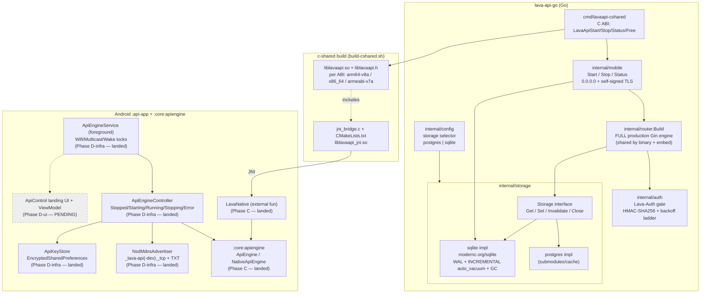
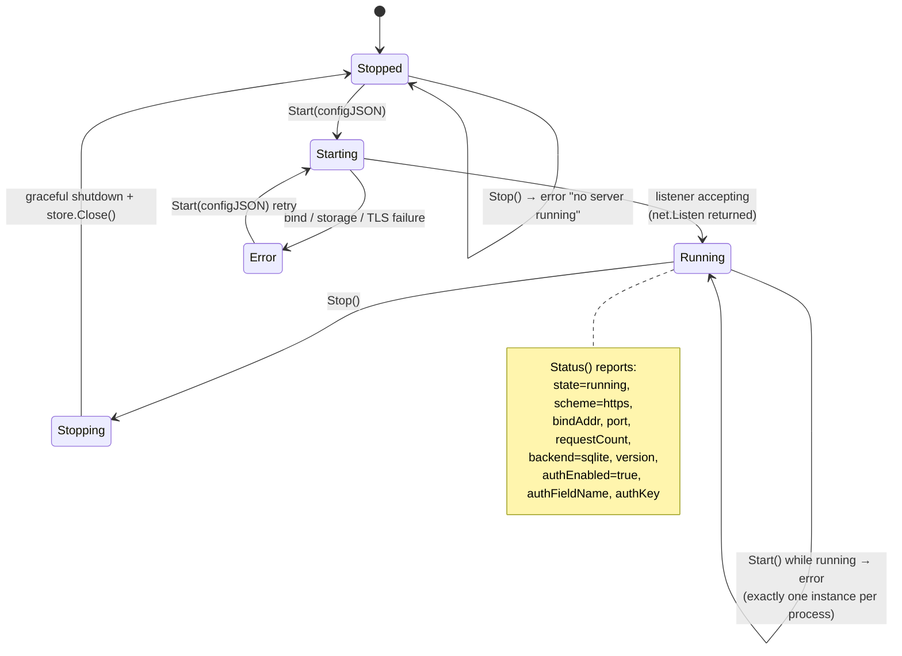
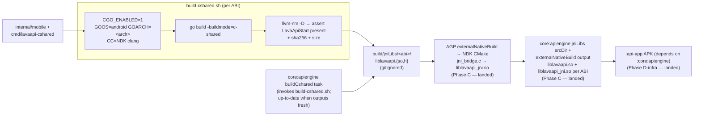

# On-Device Lava API (Android)

> **Status of this document (2026-06-02):** Phases A, B, C, and D-infra of the
> *Lava API Android app* sub-project (spec
> [`docs/superpowers/specs/2026-06-02-lava-api-android-app-design.md`](superpowers/specs/2026-06-02-lava-api-android-app-design.md),
> plan [`docs/superpowers/plans/2026-06-02-lava-api-android-app.md`](superpowers/plans/2026-06-02-lava-api-android-app.md))
> have landed. This document describes **only what the committed code does** —
> the additive SQLite storage backend (Phase A), the in-process Go embed +
> c-shared/JNI native build (Phase B), the `:core:apiengine` Kotlin JNI wrapper
> (Phase C, commit `ef109760`), and the `:api-app` headless infrastructure
> (Phase D-infra, commit `e62e0fa8`: the foreground `ApiEngineService`, the
> `ApiEngineController` state machine, the `NsdManager` advertiser, and the
> per-install auth-key store). The **landing UI / control screen + ViewModel**
> (Phase D-ui), the instrumented **Compose UI Challenge tests** (Phase E), and
> the **client-side distinct labelling** of Android instances (sub-project 2)
> are **PENDING** and are explicitly marked as such below. Nothing in this doc
> describes behavior that is not yet in the tree.
>
> `Classification:` project-specific (the on-device-API app + Go SQLite backend
> are Lava-specific; the additive-backend-selector pattern is universal and is
> noted as such inline).

## 1. Motivation

The existing Lava API (`lava-api-go`) runs on a host (server, NAS, or developer
workstation) backed by Postgres, advertises itself on the LAN via mDNS, and the
Android client discovers and talks to it over HTTPS. The on-device API
sub-project lets a **phone or tablet itself become a LAN-reachable Lava API**:
the same Go server, cross-compiled and embedded in-process, backed by a local
SQLite file, bound to `0.0.0.0` so other devices on the same Wi-Fi can discover
and use it.

The design constraint the operator set is *additive*: "Nothing already working
can be broken — only extended for more flexibility." Every existing Postgres
deployment behaves byte-for-byte as before; SQLite and the embed are new,
config-selected branches.

## 2. The additive SQLite storage backend (Phase A — landed)

### 2.1 Principle (universal pattern)

A **backend selector** whose default reproduces today's behavior exactly. The
existing code becomes "the Postgres branch," never "the only path." Any
deployment that sets `LAVA_API_PG_URL` and nothing else behaves identically to
before.

`Classification:` the selector pattern itself is universal; the two concrete
backends are Lava-specific.

### 2.2 Config selection

Source: [`lava-api-go/internal/config/config.go`](../lava-api-go/internal/config/config.go).

| Variable | Meaning | Required when |
|---|---|---|
| `LAVA_API_STORAGE_BACKEND` | `postgres` (default) or `sqlite` | never (defaults to `postgres`) |
| `LAVA_API_PG_URL` | Postgres connection URL | iff backend is `postgres` |
| `LAVA_API_SQLITE_PATH` | SQLite database file path (e.g. `/data/lava-api.db`; `:memory:` accepted) | iff backend is `sqlite` |

`config.Load()` selects the branch in a `switch cfg.StorageBackend`:

- `postgres` → require `PGUrl` (the historical hard dependency, now scoped to
  this branch so existing users are unaffected).
- `sqlite` → require `SQLitePath`.
- anything else → reject with `unknown storage backend %q`.

No env var was renamed or removed; the two new variables carry placeholders in
`.env.example` (§6.R). `LAVA_API_TLS_CERT`/`LAVA_API_TLS_KEY` and a valid
`LAVA_API_MDNS_PORT` remain required regardless of backend.

### 2.3 Storage boundary and parity with Postgres

Source: [`lava-api-go/internal/storage/`](../lava-api-go/internal/storage/).

The `storage.Storage` interface
([`storage.go`](../lava-api-go/internal/storage/storage.go)) declares **exactly**
the cache operations the handlers depend on — enumerated from the real handler
consumers, nothing more:

```go
type Storage interface {
    Get(ctx context.Context, key string) ([]byte, cache.Outcome, error)
    Set(ctx context.Context, key string, value []byte, ttl time.Duration) error
    Invalidate(ctx context.Context, key string) error
    Close() error
}
```

Two implementations satisfy it interchangeably:

- **postgres** — wraps the existing `submodules/cache/pkg/postgres` adapter
  (`response_cache` table, schema `lava_api`, 10-minute GC interval). Behavior
  is unchanged from the prior `main.go` path.
- **sqlite** — pure-Go [`modernc.org/sqlite`](https://pkg.go.dev/modernc.org/sqlite)
  (CGo-free, so it cross-compiles cleanly for Android). Behavior parity with
  Postgres is the explicit goal and is verified by a shared conformance
  harness plus a cross-backend parity test (per the plan).

`storage.New(cfg)` ([`factory.go`](../lava-api-go/internal/storage/factory.go))
selects the implementation by `cfg.StorageBackend` and returns the `Storage`
together with a `ReadinessFunc` (the `/ready` probe): Postgres uses
`pgClient.HealthCheck`; SQLite does a trivial round-trip `Get` of a sentinel key
to prove the handle answers queries.

### 2.4 SQLite TTL, GC, and WAL semantics

Source: [`sqlite.go`](../lava-api-go/internal/storage/sqlite.go),
migration [`migrations/sqlite/0001_init.sql`](../lava-api-go/internal/migrations/sqlite/0001_init.sql).

Schema mirrors the Postgres `response_cache` table with portable types:

```sql
CREATE TABLE IF NOT EXISTS response_cache (
    cache_key   TEXT PRIMARY KEY,
    value       BLOB NOT NULL,        -- BYTEA equivalent
    expires_at  INTEGER               -- unix NANOSECONDS; NULL = never expires
);
CREATE INDEX IF NOT EXISTS response_cache_expires_at_idx ON response_cache (expires_at);
```

Behavioral details the committed code implements:

- **TTL** is an absolute `expires_at` (unix nanoseconds). `Set` with `ttl > 0`
  stores `now + ttl`; `ttl <= 0` stores SQL `NULL` (never expires) — matching
  the Postgres `WHERE expires_at IS NULL OR expires_at > NOW()` contract.
- **Lazy expiry on read.** `Get` filters `expires_at IS NULL OR expires_at > ?`,
  so an expired entry reads as an `OutcomeMiss`, never a stale hit. A real DB
  error returns `OutcomeBypass + err` so callers fall through to the upstream —
  identical to `cache.Client.Get`. A stored zero-length value is a **hit**
  (non-nil empty slice), matching Postgres `BYTEA` empty-value semantics.
- **Background GC.** A goroutine runs `sweepExpired` every **10 minutes**
  (`sqliteGCInterval`, mirroring the Postgres GC cadence). It physically
  `DELETE`s rows whose `expires_at` is in the past and then runs
  `PRAGMA incremental_vacuum` to return freed pages to the free list. `Close()`
  cancels the goroutine's context and joins it (no leak); `Close()` is
  idempotent.
- **WAL + auto_vacuum** (on-disk databases only; skipped for `:memory:`):
  - The DSN sets `journal_mode(WAL)` (concurrent readers don't block the single
    writer) and `busy_timeout(5000)` (ride out brief write locks).
  - `SetMaxOpenConns(1)` serializes access through one connection — the
    standard race-free choice for an embedded SQLite writer, and required so the
    connection-scoped `auto_vacuum` PRAGMA applies to the one connection every
    query uses.
  - `PRAGMA auto_vacuum=INCREMENTAL` followed by `VACUUM` is run **before** the
    migration (the VACUUM rewrites the DB header with the new flag; order is
    load-bearing — running the PRAGMA after a table exists leaves
    `auto_vacuum=0`).
  - After migration, `PRAGMA journal_mode` is re-queried and the constructor
    **fails loudly** if WAL did not engage, refusing to run in a weaker
    (DELETE) journal mode that would drop the concurrent-reader guarantee.

## 3. The in-process Go embed (Phase B — landed)

Source: [`lava-api-go/internal/mobile/mobile.go`](../lava-api-go/internal/mobile/mobile.go)
and [`tls.go`](../lava-api-go/internal/mobile/tls.go).

`internal/mobile` is the small, JNI-friendly lifecycle surface that boots the
**full production API in-process** inside the Android app (Phases C/D will call
it). Three exported functions, designed so only `string`/`error` cross the
boundary:

```go
func Start(configJSON string) error  // parse config → SQLite + full router + TLS, listen, return when accepting
func Stop()  error                   // graceful shutdown + close storage; errors if nothing running
func Status() string                 // JSON: state, scheme, bindAddr, port, requestCount, backend, version, auth*
```

`Start`'s `configJSON` shape:
`{"bindAddr":"0.0.0.0","port":8443,"sqlitePath":"/data/x.db","authSharedKey":"<base64-uuid>","authFieldName":"<header>"}`
— `bindAddr`/`port` optional (default `0.0.0.0:8443`); `sqlitePath` required;
`authSharedKey`/`authFieldName` optional (see §3.4). Exactly one server instance
may run per process (a package-level handle guarded by a mutex; `Start` while
running returns an error).

### 3.1 Why c-shared, not gomobile

Source: [`lava-api-go/cmd/lavaapi-cshared/main.go`](../lava-api-go/cmd/lavaapi-cshared/main.go).

`gomobile bind` is **BLOCKED** on this module. `lava-api-go`'s `go.mod` uses
relative `replace ../submodules/*` directives for the 16 vasic-digital
submodules; gomobile's overlay-module generator cannot resolve them (it writes a
0-byte `go.mod`; proven on NDK 21.4 + 25.1). The chosen replacement is
**`go build -buildmode=c-shared`**, which uses ordinary Go module resolution and
therefore HONORS the replace directives. It is still an in-process,
cross-compiled Go artifact.

The tradeoff: c-shared exports a flat C ABI, not a generated Java class
hierarchy. A **hand-written JNI bridge** adapts the four exported C functions to
the JNI naming convention the Kotlin side will bind.

The exported C surface (all strings NUL-terminated UTF-8; every returned
`char*` is heap-allocated by `C.CString` and the caller MUST release it via
`LavaApiFree`):

```c
extern char* LavaApiStart(char* configJSON);  // "" on success, else error msg
extern char* LavaApiStop(void);                // "" on success, else error msg
extern char* LavaApiStatus(void);              // status JSON document
extern void  LavaApiFree(char* p);             // free a returned string
```

### 3.2 The JNI contract

Source: [`lava-api-go/cmd/lavaapi-cshared/jni/jni_bridge.c`](../lava-api-go/cmd/lavaapi-cshared/jni/jni_bridge.c)
and [`CMakeLists.txt`](../lava-api-go/cmd/lavaapi-cshared/jni/CMakeLists.txt).

`jni_bridge.c` builds `liblavaapi_jni.so`, which links against the prebuilt
`liblavaapi.so` (from the c-shared build) and exposes the entry points the
Kotlin side will bind:

```kotlin
package digital.vasic.lava.apigo

object LavaNative {
    external fun nativeStart(configJson: String): String  // "" on success, else error message
    external fun nativeStop(): String                      // "" on success, else error message
    external fun nativeStatus(): String                    // status JSON document
}
```

JNI symbol names (package dots → underscores, then class, then method):

- `Java_digital_vasic_lava_apigo_LavaNative_nativeStart`
- `Java_digital_vasic_lava_apigo_LavaNative_nativeStop`
- `Java_digital_vasic_lava_apigo_LavaNative_nativeStatus`

A Kotlin `object` compiles to a final class with a static `INSTANCE`; its
`external` functions register as native methods that receive a `jclass`, so the
bridge functions take `(JNIEnv*, jclass, ...)`. The bridge copies each
Go-returned C string into a JVM string via `NewStringUTF` and immediately
releases the C buffer via `LavaApiFree` so nothing leaks across the boundary.

`jni_bridge.c` and its `CMakeLists.txt` live in the `jni/` **subdirectory**, NOT
the cgo `main` package, because `jni_bridge.c` `#include`s `liblavaapi.h` — the
cgo-*generated* header the c-shared build PRODUCES — so it cannot be compiled by
the cgo build itself; it is compiled later by the Android NDK toolchain via
`externalNativeBuild { cmake { ... } }`.

> **LANDED (Phase C, commit `ef109760`):** the Kotlin `LavaNative` object, the
> `:core:apiengine` wrapper module, and the `externalNativeBuild` Gradle wiring
> that loads these native libraries now exist in the tree and match the contract
> above exactly. See [§4A — Phase C](#4a-phase-c--the-coreapiengine-jni-wrapper-landed)
> for the full mapping.

### 3.3 What the embed serves (full production router) + TLS

The embed builds the **EXACT same Gin engine** the production `cmd/lava-api-go`
binary builds, via the shared `internal/router.Build` constructor
([`router.go`](../lava-api-go/internal/router/router.go)) — search / browse /
topic / forum / torrent / login / favorites / captcha, `/v1/{provider}/...`,
plus `/health` and `/ready`. The provider registry wires the same adapters
production wires (rutracker, nnmclub, kinozal, archive.org, gutenberg). Sharing
one router constructor is deliberate (§6.J): a divergent embed router would be a
bluff vector — green tests against an embed serving different routes than
production would guarantee nothing about production.

The **only** transport difference from the LAN binary: the embed serves
HTTP/1.1 + HTTP/2 over TLS using a standard `net/http` server; the binary
additionally serves HTTP/3 (QUIC). HTTP/3 is not required for the embed — LAN
clients that discover the on-device API speak ordinary HTTPS. The embed
explicitly disables Brotli / protocol-metric / AltSvc middlewares (transport
tuning, not security) so repeated in-process `Start`/`Stop` cycles don't touch
the Prometheus default registerer.

**TLS** ([`tls.go`](../lava-api-go/internal/mobile/tls.go)):

- A self-signed **ECDSA P-256** cert + key is generated on first boot and
  persisted next to the SQLite DB (`lava-embed-cert.pem` / `lava-embed-key.pem`;
  the key is written `0600`). Validity is 10 years (rotation handling is a later
  sub-project).
- If both files already exist and parse, they are **reused** across restarts, so
  a peer that pinned the leaf cert out-of-band does not see it change every boot.
- **IP SANs:** loopback (IPv4 + IPv6) plus the host's non-loopback,
  non-link-local LAN IPs discovered at boot (`localIPs()`), so a peer addressing
  the server by LAN IP does not hit a host-mismatch error.
- **No wildcard DNS SAN.** DNS SANs are limited to `localhost` — a bare `*`
  wildcard SAN matched ANY hostname and defeated name verification (a
  security-review finding; fixed in commit `6f751495`). Peers address the embed
  by LAN IP (covered by the IP SANs) or by `localhost` on-device. Out-of-band
  leaf trust on the consuming devices is the model for now (full client-trust /
  local-CA handling is a later sub-project).

### 3.4 The Lava-Auth gate on the embed (same mechanism as the host)

Because the embed is network-exposed (§3.5), it **MUST authenticate** — there is
no "trusted LAN" shortcut. It enforces the **identical** Lava-Auth gate the
production LAN binary uses (`internal/auth.NewMiddleware` +
`NewBackoffMiddleware`, source
[`middleware.go`](../lava-api-go/internal/auth/middleware.go)):

- The client presents a credential in a configurable header (default
  `Lava-Auth`). The credential is `base64(16-byte UUID blob)`.
- The middleware base64-decodes the header, computes
  `hex(HMAC-SHA256(uuid_bytes, secret))`, and compares (in constant time, to
  defeat timing side-channels) against the active-clients allowlist.
- Active hash → request served (`client_name` set, backoff reset). Retired hash
  → 426 Upgrade Required. Missing / malformed / unknown → 401 and the per-IP
  backoff ladder advances; repeated failures escalate to 429 on the default
  ladder `2s,5s,10s,30s,1m,1h`.
- `/health` and `/ready` are registered **before** the auth middleware so the
  orchestrator probes work without a credential.

The embed's app-managed key flow:

- The host app supplies the credential via `authSharedKey` in the Start config.
- **If none is supplied, the embed GENERATES one** (random 16-byte UUID,
  base64-encoded) so the gate is never disabled. The generated/in-effect key is
  surfaced via `Status()` (the `authKey` field) — and **only** there — so the
  app can display it for pairing. It is deliberately never written to a log line
  (§6.H / §6.AC redaction). The plaintext blob is zeroized after hashing.
- `Status().authEnabled` is always `true` while running.

> **LANDED (Phase D-infra, commit `e62e0fa8`):** persisting the key across app
> restarts is now the `:api-app` `ApiKeyStore`'s responsibility (a per-install
> base64-UUID blob held in `EncryptedSharedPreferences`); see
> [§4B.4 — auth-key store](#4b4-the-per-install-auth-key-store-apikeystore). The
> UI that shows it for pairing remains **PENDING (Phase D-ui)**. The Go embed
> surface here only ENFORCES whatever key is in effect and reports it via
> `Status()`.

### 3.5 Network exposure (0.0.0.0) and the trust boundary

The embed binds **`0.0.0.0`** by default — network exposure is the intended
design. Loopback-only would defeat the feature (the whole point is that a phone
running the embed becomes a LAN-reachable Lava API for tablets, TVs, and other
phones). The bind address is validated with `net.ParseIP`; non-loopback
(including the `0.0.0.0` wildcard) is explicitly allowed, and only
unparseable IPs are rejected. The automated security-review suggestion of
loopback-only was therefore explicitly overridden in the code, with the Lava-Auth
gate (§3.4) as the compensating control: anyone on the LAN can *reach* the port,
but only a holder of the auth key gets a non-401 response.

### 3.6 mDNS identity (Android instance vs host instance)

The embed is honestly the Go engine on Android with SQLite, so it will advertise:

- Service type `_lava-api._tcp` (release) / `_lava-api-dev._tcp` (debug) — the
  same types the client already watches (catalog in
  [`core/data/.../DiscoveryServiceTypes.kt`](../core/data/src/main/kotlin/lava/data/api/service/DiscoveryServiceTypes.kt):
  `SERVICE_TYPE_GO = "_lava-api._tcp"`, `SERVICE_TYPE_GO_DEV = "_lava-api-dev._tcp"`,
  `SERVICE_TYPE_KTOR = "_lava._tcp"`).
- TXT: `engine=go`, **`platform=android`**, `storage=sqlite`, `version=<n>`.

The existing host instance keeps advertising `engine=go` with
`platform=server` (or absent) — unchanged; both appear in the client's list. The
"distinct identity" is realized via the `platform` TXT key, which the client
(sub-project 2) will label distinctly without any discovery re-architecture.
Instances without `platform` render exactly as today (backward compatible).

> **LANDED (Phase D-infra, commit `e62e0fa8`):** the on-device `NsdManager`
> *registration* (the embed advertising itself) now exists in `:api-app` as
> `NsdMdnsAdvertiser`; see
> [§4B.3 — mDNS advertiser](#4b3-the-mdns-advertiser-nsdmdnsadvertiser). The
> client-side *discovery* that consumes these TXT records already exists in
> [`LocalNetworkDiscoveryServiceImpl`](../core/data/src/main/kotlin/lava/data/impl/service/LocalNetworkDiscoveryServiceImpl.kt)
> and is described in [`LOCAL_NETWORK_DISCOVERY.md`](LOCAL_NETWORK_DISCOVERY.md).

## 4A. Phase C — the `:core:apiengine` JNI wrapper (landed)

Source: [`core/apiengine/`](../core/apiengine/) (commit `ef109760`).

`:core:apiengine` is an Android library that exposes the embedded lava-api-go
server (the Go c-shared library + JNI bridge from Phase B) behind an ordinary
Kotlin `suspend`-function API. Consumers (`:api-app`, future wiring) depend ONLY
on this module's public surface — never on `LavaNative` directly. Per the
Decoupled Reusable Architecture rule this is Lava-domain glue: it introduces no
logic another vasic-digital project would consume.

### 4A.1 The public Kotlin surface (`ApiEngine`)

Source: [`ApiEngine.kt`](../core/apiengine/src/main/kotlin/lava/apiengine/ApiEngine.kt)
(package `lava.apiengine`).

```kotlin
interface ApiEngine {
    suspend fun start(config: ApiConfig): Result<ApiStatus>  // success → running ApiStatus; failure → native error
    suspend fun stop(): Result<Unit>                          // failure when nothing is running (not a silent no-op)
    fun status(): ApiStatus                                   // non-suspending snapshot
}
```

`ApiConfig` is the start-time configuration, serialized to the exact JSON shape
`internal/mobile.startConfig` parses:

| Field | Type | Default | Meaning |
|---|---|---|---|
| `bindAddr` | `String` | `"0.0.0.0"` | bind IP; wildcard so LAN peers can reach the API (loopback-only would defeat the feature) |
| `port` | `Int` | `8443` | TCP listener port, matching the production LAN listener |
| `sqlitePath` | `String` | *(required)* | absolute path to the SQLite DB file; TLS material is persisted beside it |
| `authSharedKey` | `String?` | `null` | the base64-UUID credential; when `null` the embed GENERATES one and surfaces it via `ApiStatus.authKey` (there is no unauthenticated mode) |
| `authFieldName` | `String` | `"Lava-Auth"` | HTTP header the credential is read from |

`ApiStatus` mirrors the JSON `internal/mobile.Status()` returns:
`state` (`"running"`/`"stopped"`), `bindAddr`, `port`, `requestCount`, `backend`
(always `"sqlite"`), `version`, `scheme` (always `"https"`), `authEnabled`
(always `true` while running), `authFieldName`, and the nullable `authKey` (the
in-effect credential the host app can display for pairing; `null` when stopped).

Exactly one server instance runs per process (enforced by the native side):
`start` while already running returns a failed `Result`.

### 4A.2 `NativeApiEngine` — the real JNI-backed implementation

Source: [`NativeApiEngine.kt`](../core/apiengine/src/main/kotlin/lava/apiengine/NativeApiEngine.kt).

`NativeApiEngine` is the production `ApiEngine`. It maps the Kotlin surface onto
the three `LavaNative` external functions:

- `start(config)` serializes `config` to JSON via `kotlinx.serialization`
  (`ConfigDto` — field names `bindAddr`/`port`/`sqlitePath`/`authSharedKey`/
  `authFieldName` matching the Go `startConfig` tags; a `null` `authSharedKey` is
  emitted as `""`, which the Go side treats as "generate one"), calls
  `LavaNative.nativeStart(configJson)`, and — because the native Start/Stop
  contract is "empty string on success, error message otherwise" — maps a
  non-empty return to `Result.failure(ApiEngineException(err))`. On success it
  parses `LavaNative.nativeStatus()` into `ApiStatus`.
- `stop()` calls `LavaNative.nativeStop()` and applies the same empty-string =
  success mapping.
- `status()` parses `LavaNative.nativeStatus()` (the `StatusDto` fields are
  `omitempty` on the Go side when stopped, so they default to stopped-state zero
  values).

`start` and `stop` run on an injectable `CoroutineDispatcher` (default
`Dispatchers.IO`) because the native calls may block on socket bind / TLS
material generation / SQLite open. The class requires a real Android
device/emulator (the native `.so` is Android-only), so it is NOT JVM-unit-
testable; its behavioral contract is verified by the Phase E Compose UI
Challenge against a real emulator (PENDING). The JVM-testable contract lives in
`FakeApiEngine`.

### 4A.3 `LavaNative` — the JNI binding

Source: [`LavaNative.kt`](../core/apiengine/src/main/kotlin/lava/apiengine/LavaNative.kt)
(package `digital.vasic.lava.apigo` — chosen to match the JNI symbol encoding).

```kotlin
package digital.vasic.lava.apigo

internal object LavaNative {
    init { System.loadLibrary("lavaapi_jni") }
    external fun nativeStart(configJson: String): String  // "" on success, else error message
    external fun nativeStop(): String                      // "" on success, else error message
    external fun nativeStatus(): String                    // status JSON document
}
```

The package + object + method names MUST match the JNI symbol encoding in
`jni_bridge.c` exactly (e.g. `Java_digital_vasic_lava_apigo_LavaNative_nativeStart`).
`System.loadLibrary("lavaapi_jni")` resolves to `liblavaapi_jni.so`; its
transitive dependency on `liblavaapi.so` (the prebuilt Go c-shared library) is
satisfied because BOTH libraries are packaged into the same `jniLibs/<abi>/`
directory of the APK. The object is `internal` — consumers go through
`NativeApiEngine`, never here.

### 4A.4 `FakeApiEngine` — the behaviorally-equivalent JVM fake

Source: [`FakeApiEngine.kt`](../core/apiengine/src/main/kotlin/lava/apiengine/FakeApiEngine.kt).

Per the Anti-Bluff Pact Third Law, the fake reproduces the production / Go
BRANCHES that affect callers — it is NOT a "simpler than reality" stub:

- **Single instance.** `start` while already running fails with an
  "already running" error matching the Go `"mobile: server already running …"`.
- **Stop is not a no-op.** `stop` without a running server fails with a
  "no server running" error matching `internal/mobile.Stop`.
- **Status reflects last start/stop.** `stopped` before any start; `running`
  with the started config's bindAddr/port after `start`; reverts to `stopped`
  after `stop`.
- **Auth always on while running.** `start` surfaces an auth key (the config's
  `authSharedKey` when provided, else a deterministic generated stand-in) and
  reports `authEnabled == true` — no unauthenticated mode.
- **Error injection.** `failWith(error)` makes the next `start`/`stop` propagate
  a `Result.failure`, exercising callers' error paths. `recordRequests(count)`
  simulates inbound traffic so `status()` reports a non-zero count.

### 4A.5 The native build pipeline (`buildCshared` → jniLibs → externalNativeBuild)

Source: [`core/apiengine/build.gradle.kts`](../core/apiengine/build.gradle.kts).

Two native libraries are packaged per ABI into this module's AAR, for the three
ABIs `arm64-v8a` / `x86_64` / `armeabi-v7a` (NDK `25.1.8937393`, CMake `3.22.1`):

1. **`liblavaapi.so`** — the prebuilt Go c-shared library. A `buildCshared`
   Gradle `Exec` task shells out to `lava-api-go/scripts/build-cshared.sh` for
   the module's ABIs, writing `lava-api-go/build/jniLibs/<abi>/liblavaapi.{so,h}`.
   The task declares those `.so`/`.h` as `outputs` so it is **up-to-date when all
   expected outputs are already present** — a clean assemble does not force a
   multi-minute Go rebuild when the artifacts are fresh. On a Windows build host
   the task fails honestly (the Go c-shared/JNI path is unsupported there) rather
   than producing a broken artifact. `sourceSets.main.jniLibs.srcDir(prebuiltJniLibsDir)`
   points AGP at that output dir so it packages `liblavaapi.so` per ABI directly
   (Go is NOT recompiled from Gradle — the script output is LOCATED and staged).
2. **`liblavaapi_jni.so`** — the hand-written JNI bridge. AGP's
   `externalNativeBuild { cmake { path = jniCmakeLists } }` points at the
   canonical `lava-api-go/cmd/lavaapi-cshared/jni/CMakeLists.txt`, which imports
   `liblavaapi.so` as an IMPORTED SHARED lib and links the bridge against it.
   `-DLAVAAPI_PREBUILT_DIR=<abs path>` is passed as a CMake argument so the
   CMakeLists finds the prebuilt `.so`/`.h` (laid out as `<ABI>/liblavaapi.{so,h}`).

The native-build / jniLibs-merge tasks (`externalNativeBuild*`, `configureCMake*`,
`buildCMake*`, `merge*JniLibFolders`) all `dependsOn(buildCshared)` so the
prebuilt inputs exist before CMake configures and before the jniLibs merge reads
the directory.

## 4B. Phase D-infra — the `:api-app` module (landed)

Source: [`api-app/`](../api-app/) (commit `e62e0fa8`).

`:api-app` is the standalone *Lava API* Android application. It hosts the
embedded lava-api-go server (via `:core:apiengine`) as an on-device,
LAN-reachable HTTPS API, advertised over mDNS so other devices discover it.
Phase D-infra delivers the **headless infrastructure** only: the foreground
Service, the Android-free lifecycle controller, the mDNS advertiser, and the
per-install auth-key store. The Compose landing UI, the refined notification
copy, and the ViewModel are **Phase D-ui (PENDING)**; this module ships a
placeholder `MainActivity` (its `onCreate` calls `setContent { }`) so the
manifest is valid and the APK assembles.

### 4B.1 Module identity, signing, and permissions

Source: [`api-app/build.gradle.kts`](../api-app/build.gradle.kts),
[`AndroidManifest.xml`](../api-app/src/main/AndroidManifest.xml).

- **Application ID** `digital.vasic.lava.api`; the debug build applies
  `applicationIdSuffix = ".dev"` → `digital.vasic.lava.api.dev`, so the
  release and dev variants install side-by-side and advertise distinct mDNS
  service types (§4B.3). `versionCode = 1`, `versionName = "0.1.0"`,
  `minSdk = 23` (the per-install auth-key store relies on
  `EncryptedSharedPreferences`, which requires API 23+; the client `:app` keeps
  `minSdk 21`).
- **Shared signing.** The signing block mirrors `:app`'s `.env`-driven inputs
  verbatim — the SAME `KEYSTORE_PASSWORD` + `KEYSTORE_ROOT_DIR` keystore
  material (debug → `keystores/debug.keystore` alias `debug`; release →
  `keystores/release.keystore` alias `release`). No parallel signing scheme is
  invented (§6.R / §6.H). Release uses `postprocessing` (remove-unused-code +
  remove-unused-resources + optimize, `isObfuscate = false`).
- **Permissions** the embed needs while serving:
  `INTERNET`, `ACCESS_NETWORK_STATE`, `ACCESS_WIFI_STATE`,
  `CHANGE_WIFI_MULTICAST_STATE` (mDNS multicast), `FOREGROUND_SERVICE` +
  `FOREGROUND_SERVICE_DATA_SYNC`, `POST_NOTIFICATIONS`, and `WAKE_LOCK`. The
  application sets `android:usesCleartextTraffic="true"` (matching the client
  `:app`). The Service is declared `android:exported="false"` with
  `android:foregroundServiceType="dataSync"` (the closest standard type for a
  process that continuously serves LAN requests + advertises over mDNS). The
  `ApiApplication` is a `@HiltAndroidApp` root; D-infra wires no Hilt modules
  (the Service constructs its controller directly) — the annotation is present
  so D-ui can add injected ViewModels without re-shaping the app.

### 4B.2 The foreground `ApiEngineService` + OS locks

Source: [`service/ApiEngineService.kt`](../api-app/src/main/kotlin/lava/api/app/service/ApiEngineService.kt).

A foreground `Service` that owns the Android-free `ApiEngineController` and
drives it via intent actions:

- **Intent actions:** `ACTION_START` (`lava.api.app.action.START`, the default),
  `ACTION_STOP`, `ACTION_RESTART`. `onStartCommand` promotes to foreground
  *immediately* (`startForeground` with a baseline notification) so the OS does
  not kill the process before the first state emission, then dispatches the
  matching `controller.start()` / `stop()` / `restart()` on a service-scoped
  `CoroutineScope` (cancelled in `onDestroy`). It returns `START_STICKY`.
- **OS locks held while serving** (acquired on `Running`, released on `Stopped`
  / `Error` / `onDestroy`):
  - a Wi-Fi **`MulticastLock`** so mDNS multicast reaches the LAN;
  - a Wi-Fi **`WifiLock`** in `WIFI_MODE_FULL_HIGH_PERF` so the radio stays up;
  - a **partial `WakeLock`** (`PARTIAL_WAKE_LOCK`) so the CPU keeps serving while
    the screen is off.
  All three are `setReferenceCounted(false)` and released the moment the API
  stops (idempotent release guarded by `isHeld`).
- **The controller is built** with a `NativeApiEngine`, an `NsdMdnsAdvertiser`
  whose engine identity is `GO_DEV` when the package name ends in `.dev` else
  `GO`, an `ApiKeyStoreImpl.create(applicationContext)`, a
  `NetworkInterfaceLanIpProvider`, and a `sqlitePath` of
  `filesDir/lava-api.db`.
- **Foreground notification:** an ongoing, low-importance notification on channel
  `lava.api.app.server`. When `Running` the body shows `"<url>  •  <n> req"`
  (reachable URL + live request count); it carries **Stop** + **Restart** actions
  (each a `PendingIntent.getService` with the matching action) and a
  content-intent back to `MainActivity`. The copy is intentionally minimal
  (Phase D-ui refines it).

### 4B.2a The `ApiEngineController` state machine

Source: [`control/ApiEngineController.kt`](../api-app/src/main/kotlin/lava/api/app/control/ApiEngineController.kt),
[`control/ApiControlState.kt`](../api-app/src/main/kotlin/lava/api/app/control/ApiControlState.kt).

The controller is the **Android-free lifecycle core** — it has NO Service /
Context dependency, so it is unit-tested with the real controller wired to
`FakeApiEngine` + fakes for the advertiser/keyStore (the load-bearing Anti-Bluff
test `ApiEngineControllerTest`). It owns the `ApiEngine`, the `MdnsAdvertiser`,
and the `ApiKeyStore`, and exposes `state: StateFlow<ApiControlState>` as the
single source of truth the Service + UI observe.

The `ApiControlState` sealed interface forms the cycle
`Stopped → Starting → Running → Stopping → Stopped`, with `Error` reachable from
`Starting`/`Stopping`:

| State | Meaning |
|---|---|
| `Stopped` | no server running (initial state) |
| `Starting` | a start was requested; the engine has not yet reported Running |
| `Running` | the embed is up; carries `url`, `lanIps`, `port`, `requestCount`, `authKey`, `authFieldName` — **all from the real post-start `ApiStatus` + the host's discovered LAN IPs, never synthesized** |
| `Stopping` | a stop was requested; shutdown not yet confirmed |
| `Error(message)` | the last start/stop failed; `message` is the engine's error text |

Behavioral details the committed code implements:

- **`start()`** emits `Starting`, fetches the persisted key via
  `keyStore.getOrCreate()`, builds an `ApiConfig` (port, sqlitePath, the key as
  `authSharedKey`, `keyStore.fieldName` as `authFieldName`), and calls
  `engine.start(config)`. On success it calls `onStarted(status)`: it resolves
  the host's LAN IPs (`lanIpProvider()`), **registers the mDNS advertisement on
  the running port**, and emits `Running` with the reachable URL built as
  `<scheme>://<first LAN IP or 127.0.0.1>:<port>`. On engine failure it emits
  `Error` and does **NOT** advertise.
- **`stop()`** emits `Stopping`, **unregisters the advertisement first** (so a
  stale record never points at a dead listener), then calls `engine.stop()`:
  success → `Stopped`, failure → `Error`.
- **`restart()`** is `stop()` then `start()`; if the `stop` surfaced an `Error`
  it halts there (a failed stop leaves the embed in an unknown state; surfacing
  Error is the honest behavior).
- The default `port` is read from `ApiConfig`'s own default so the literal lives
  in `:core:apiengine`, not duplicated here (§6.R). The host's LAN IPs come from
  `NetworkInterfaceLanIpProvider` ([`net/LanIpProvider.kt`](../api-app/src/main/kotlin/lava/api/app/net/LanIpProvider.kt)),
  which enumerates the real non-loopback, non-link-local IPv4 interface
  addresses — not a synthesized value (Sixth-Law clause 3: the URL the UI shows
  and the cert SANs the embed generates both depend on these being the TRUE
  reachable IPs).

### 4B.3 The mDNS advertiser (`NsdMdnsAdvertiser`)

Source: [`service/MdnsAdvertiser.kt`](../api-app/src/main/kotlin/lava/api/app/service/MdnsAdvertiser.kt),
[`service/NsdMdnsAdvertiser.kt`](../api-app/src/main/kotlin/lava/api/app/service/NsdMdnsAdvertiser.kt).

`MdnsAdvertiser` is a two-method interface (`register(port)` / `unregister()`);
`NsdMdnsAdvertiser` is the `NsdManager`-backed implementation. It registers a
single `NsdServiceInfo` named `"Lava API"` for the build-appropriate service
type, on the running port, with the TXT records the pure `buildTxtRecords`
builder produces. `register` first calls `unregister()` (a previous registration
is torn down before re-registering); `unregister` is safe to call when not
registered.

- **Service types** (matching `DiscoveryServiceTypeCatalog` in `core/data` — the
  cross-process mDNS protocol contract):
  - release build → `_lava-api._tcp` (engine identity `GO`)
  - debug build → `_lava-api-dev._tcp` (engine identity `GO_DEV`)
- **TXT records** (the pure, unit-testable wire contract via `buildTxtRecords` —
  verified by `MdnsAdvertiserTxtTest` without touching Android):
  `engine=go` (or `go-dev`), `platform=android`, `storage=sqlite`,
  `version=<n>`. The `version` is read from a `versionProvider` lambda
  (`engine.status().version`) at register time so the advertised version tracks
  the actual running embed, not a hardcoded literal (§6.R).

The service-type + TXT literals are kept in `:api-app` (rather than depending on
`:core:data`) so the API app does not pull in the entire client data layer; they
are identical to `DiscoveryServiceTypeCatalog.SERVICE_TYPE_GO` /
`SERVICE_TYPE_GO_DEV`.

### 4B.4 The per-install auth-key store (`ApiKeyStore`)

Source: [`auth/ApiKeyStore.kt`](../api-app/src/main/kotlin/lava/api/app/auth/ApiKeyStore.kt).

`ApiKeyStore` is a two-member interface — `getOrCreate(): String` and
`val fieldName: String`. `ApiKeyStoreImpl` implements it:

- The credential is the **production wire shape the Go embed accepts**: the
  base64 (standard alphabet, padded, single line) encoding of a random 16-byte
  UUID blob. This is EXACTLY what `internal/mobile.generateAuthKey` mints and
  what `internal/auth.NewMiddleware` base64-decodes before HMAC-ing — so a key
  produced here is honoured by the embed when passed as
  `ApiConfig.authSharedKey`.
- **First run** generates a fresh key with `SecureRandom` (16 bytes,
  `UUID_LEN`), base64-encodes it (`android.util.Base64` `NO_WRAP`, matching Go's
  `base64.StdEncoding`), and persists it; every subsequent call (this run or a
  later install lifetime) returns the SAME key so paired peer devices keep
  working. `getOrCreate` is `@Synchronized`.
- **Encrypted at rest:** `ApiKeyStoreImpl.create(context)` builds an
  `EncryptedSharedPreferences` (AES256-SIV key encryption + AES256-GCM value
  encryption, `AES256_GCM` master key) in the `lava_api_auth` prefs file. Pure-
  JVM unit tests construct `ApiKeyStoreImpl` directly with an in-memory
  `SharedPreferences` fake + a `java.util.Base64`-backed `KeyEncoder` that yields
  the identical alphabet (the encoder is injectable for exactly this reason).
- **§6.H credential hygiene:** the key is NEVER written to a log line, never
  concatenated into an exception message, never returned from `toString`. The
  plaintext blob is `fill(0)`'d in a `finally` block after encoding; the base64
  `String` leaves the process only through the deliberate display/config path
  (D-ui). The default `fieldName` is `"Lava-Auth"`, matching the embed.

> **PENDING (Phase D-ui):** the landing screen / control screen, the ViewModel,
> and the refined notification copy that DISPLAY the URL, the auth key (for
> pairing), and the live request count are not yet in the tree — `MainActivity`
> is a placeholder. **PENDING (Phase E):** the instrumented Compose UI Challenge
> tests that boot the embed on a real emulator and issue a real HTTPS request.
> **PENDING (sub-project 2):** the client-side distinct labelling of
> `platform=android` instances in the discovery list.

## 4. Diagrams

### 4.1 Component / module diagram (what has landed)



### 4.2 Start / Stop / Restart lifecycle state machine



> The Go embed itself exposes only `Stopped` and `Running` via `Status().state`.
> The `Starting`/`Stopping`/`Error` transient states are now realized in Kotlin
> by the `:api-app` `ApiEngineController` (Phase D-infra — landed; see §4B.2a):
> the controller emits `Starting` before `engine.start()` and `Stopping` before
> `engine.stop()`, and `Error(message)` when either fails. The UI that RENDERS
> these states is PENDING Phase D-ui.

### 4.3 mDNS discovery + authenticated request sequence

```mermaid
sequenceDiagram
    participant P as Phone running :api-app<br/>(ApiEngineService + controller — landed)
    participant N as LAN (mDNS / multicast)
    participant C as Other Lava client

    P->>P: Service.start → controller.start → engine.start<br/>(0.0.0.0:8443, SQLite, self-signed TLS)
    P->>P: ApiKeyStore.getOrCreate → Lava-Auth key (persisted, EncryptedSharedPreferences)
    Note over P,N: Phase D-infra — NsdMdnsAdvertiser.register (NsdManager.registerService)
    P->>N: advertise _lava-api._tcp<br/>TXT engine=go, platform=android, storage=sqlite, version=n
    C->>N: NsdManager discover _lava-api._tcp (already in-tree)
    N-->>C: resolved host:port + TXT
    C->>C: map to Endpoint.GoApi(host, port)<br/>label platform=android distinctly (PENDING sub-project 2)
    C->>P: HTTPS GET /health (no auth required)
    P-->>C: 200 OK
    C->>P: HTTPS GET /v1/{provider}/search?... (Lava-Auth: <key>)
    P->>P: auth middleware: HMAC-SHA256 vs allowlist (constant-time)
    alt valid key
        P-->>C: 200 + real JSON
    else missing / wrong key
        P-->>C: 401; backoff ladder advances → 429 on repeat
    end
```

### 4.4 Build pipeline (Go → per-ABI .so → jniLibs → app)



## 5. Building the native libraries

See the script guide [`docs/scripts/build-cshared.sh.md`](scripts/build-cshared.sh.md)
for the authoritative reference. In brief:

```bash
cd lava-api-go
./scripts/build-cshared.sh                 # all three ABIs
./scripts/build-cshared.sh arm64-v8a       # just the critical ABI
```

| ABI | `GOARCH` | NDK clang wrapper (API=28 default) |
|---|---|---|
| `arm64-v8a` | `arm64` | `aarch64-linux-android28-clang` |
| `x86_64` | `amd64` | `x86_64-linux-android28-clang` |
| `armeabi-v7a` | `arm` | `armv7a-linux-androideabi28-clang` |

Outputs land in `lava-api-go/build/jniLibs/<abi>/liblavaapi.{so,h}` (gitignored —
only the source is committed). The script prints each `.so`'s size + sha256 and
asserts `LavaApiStart` is in the dynamic symbol table via `llvm-nm`. A missing
NDK toolchain or NDK clang is reported as a hard failure (exit 2 for config
errors, 1 for build/symbol failures) — no `.so` is faked (§6.J / Anti-Bluff).

> **LANDED (Phases C + D-infra):** the `:core:apiengine` wrapper (Phase C,
> commit `ef109760`) is now the Gradle consumer of these native libraries — its
> `buildCshared` task invokes `build-cshared.sh` and its `externalNativeBuild`
> packages `liblavaapi.so` + `liblavaapi_jni.so` per ABI (see §4A.5). The
> `:api-app` module (Phase D-infra, commit `e62e0fa8`) depends on
> `:core:apiengine` and ships the foreground service + controller + on-device
> mDNS advertiser + auth-key store (see §4B).
>
> **PENDING (Phases D-ui / E):** the landing UI + control screen + ViewModel
> (Phase D-ui) and the instrumented Compose UI Challenge tests that boot the
> embed on a real emulator and issue a real HTTPS request (Phase E) are not yet
> in the tree.

## 6. Constitutional alignment (what the landed code already satisfies)

- **§6.R No-Hardcoding** — SQLite path, bind addr, port, header name, and NDK
  path/API level all come from config / env / Start-config, never literals.
- **§6.H Credential Security** — the auth key is surfaced only via `Status()`,
  never logged; plaintext UUID blobs are zeroized after hashing.
- **§6.J Anti-Bluff** — the embed reuses the production router so embed tests
  guarantee production behavior; the build script reports real `.so` evidence;
  `FakeApiEngine` reproduces the production branches (single-instance, stop-not-
  a-no-op, auth-always-on) rather than being a simpler stub; `ApiEngineController`
  is Android-free so its load-bearing test wires the REAL controller to the fake
  engine; `Running` state fields come from the real `ApiStatus` + real LAN IPs,
  never synthesized.
- **§6.U No sudo/su** — the build uses user-local NDK tooling only.

### What Phases C + D-infra add

- **§6.R No-Hardcoding** — the controller's default port is read from
  `ApiConfig`'s own default (the literal lives in `:core:apiengine`), the
  advertised `version` is read from `engine.status().version`, the LAN IPs are
  the real interface addresses, and `:api-app`'s signing reuses `:app`'s
  `.env`-driven keystore inputs rather than inventing keys.
- **§6.H Credential Security** — `ApiKeyStore` holds the credential in
  `EncryptedSharedPreferences`, zeroizes the plaintext UUID blob after encoding,
  and never logs / `toString`s / exception-concatenates the key; it is surfaced
  only through the deliberate D-ui display path.

## 7. References

- Spec: [`docs/superpowers/specs/2026-06-02-lava-api-android-app-design.md`](superpowers/specs/2026-06-02-lava-api-android-app-design.md)
- Plan: [`docs/superpowers/plans/2026-06-02-lava-api-android-app.md`](superpowers/plans/2026-06-02-lava-api-android-app.md)
- Script guide: [`docs/scripts/build-cshared.sh.md`](scripts/build-cshared.sh.md)
- User guide: [`docs/guides/ON_DEVICE_API_USER_GUIDE.md`](guides/ON_DEVICE_API_USER_GUIDE.md)
- Discovery flow: [`docs/LOCAL_NETWORK_DISCOVERY.md`](LOCAL_NETWORK_DISCOVERY.md)
- Architecture overview: [`docs/ARCHITECTURE.md`](ARCHITECTURE.md)
