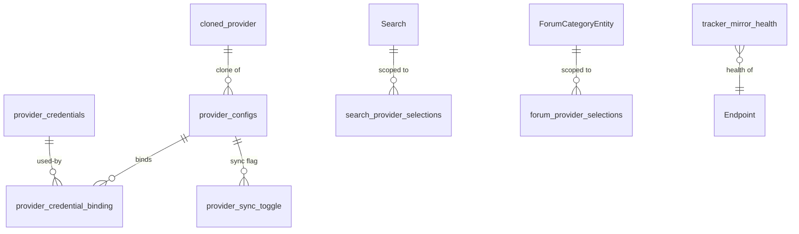

# Architecture: Data model (Android Room + lava-api-go SQL)

**Revision:** 1
**Last modified:** 2026-06-08T00:00:00Z
**Classification:** project-specific

Two independent persistence layers. Every claim below is read from real schema files
(§11.4.6 no-guessing).

## 1. Android client — Room (SQLite), `lava.database.AppDatabase`, schema **v11**

Source of truth: `core/database/schemas/lava.database.AppDatabase/11.json` (Room-generated; checked
in). 20 tables in v11:

| Group | Tables |
|---|---|
| Search & history | `Search`, `Suggest`, `HistoryTopic`, `FavoriteSearch`, `FavoriteTopic`, `Bookmark` |
| Forum | `ForumCategoryEntity`, `ForumMetadata`, `forum_provider_selections`, `search_provider_selections` |
| Endpoints / discovery | `Endpoint` |
| Provider config & credentials | `provider_configs`, `provider_credentials`, `provider_credential_binding`, `provider_sync_toggle`, `credentials_entry` |
| Cloned providers / mirrors | `cloned_provider`, `tracker_mirror_health`, `tracker_mirror_user` |
| Sync | `sync_outbox` |

Schema history: `5.json` → `10.json` → `11.json` (the v10→v11 migration added the `use_anonymous`
column to provider config — the fix from the prior completeness cycle). Migrations are Room
`Migration` objects in `core/database`; schemas are validated against the checked-in JSON.


(Relations inferred from table names + the provider-config feature; column-level FKs are documented
in `11.json` — read it for exact columns/indices.)

## 2. lava-api-go — SQL (Postgres or SQLite), schema `lava_api`

Storage is **pluggable** (`lava-api-go/internal/storage/{factory,sqlite}.go` — SQLite for local/dev,
Postgres for the deployed stack). DDL source of truth: `lava-api-go/migrations/*.up.sql`
(golang-migrate). Real tables (verbatim from the migration files):

**`lava_api.response_cache`** (0001 + realigned 0005 — must match `submodules/cache/pkg/postgres`'s
`(cache_key, value, expires_at)` INSERT shape; a 2.0.0 mismatch silently cached nothing — forensic
note in 0001):
```sql
CREATE TABLE IF NOT EXISTS lava_api.response_cache (
    cache_key   TEXT PRIMARY KEY,
    value       BYTEA NOT NULL,
    expires_at  TIMESTAMPTZ
);
```

**`lava_api.request_audit`** (0002):
```sql
CREATE TABLE IF NOT EXISTS lava_api.request_audit (
    id BIGSERIAL PRIMARY KEY, received_at TIMESTAMPTZ NOT NULL DEFAULT now(),
    method TEXT NOT NULL, path TEXT NOT NULL, query TEXT, client_ip INET,
    auth_realm_hash TEXT, upstream_status SMALLINT, upstream_ms INTEGER,
    cache_outcome TEXT NOT NULL, bytes_out INTEGER
);
```

**`lava_api.rate_limit_bucket`** (0003) — token-bucket per (client_ip, route_class):
```sql
CREATE TABLE IF NOT EXISTS lava_api.rate_limit_bucket (
    client_ip INET NOT NULL, route_class TEXT NOT NULL,
    tokens DOUBLE PRECISION NOT NULL, last_refill_at TIMESTAMPTZ NOT NULL,
    PRIMARY KEY (client_ip, route_class)
);
```

**`lava_api.login_attempt`** (0004) — usernames stored only as `username_hash` (§6.H):
```sql
CREATE TABLE IF NOT EXISTS lava_api.login_attempt (
    id BIGSERIAL PRIMARY KEY, client_ip INET NOT NULL, username_hash TEXT NOT NULL,
    succeeded BOOLEAN NOT NULL, attempted_at TIMESTAMPTZ NOT NULL DEFAULT now()
);
```

**`lava_api.provider_credentials`** (0006) — secrets stored **encrypted at the application layer**
before insert (`encrypted_password`/`encrypted_token`/`encrypted_api_key`/`encrypted_api_secret`);
plaintext never persisted (§6.H):
```sql
CREATE TABLE IF NOT EXISTS lava_api.provider_credentials (
    provider_id TEXT PRIMARY KEY, auth_type TEXT NOT NULL DEFAULT 'none',
    username TEXT, encrypted_password TEXT, encrypted_token TEXT,
    encrypted_api_key TEXT, encrypted_api_secret TEXT, cookie_value TEXT,
    expires_at TIMESTAMPTZ, is_active BOOLEAN NOT NULL DEFAULT true,
    last_used_at TIMESTAMPTZ, created_at TIMESTAMPTZ NOT NULL DEFAULT now(),
    updated_at TIMESTAMPTZ NOT NULL DEFAULT now()
);
```

**`lava_api.provider_configs`** (0007) — per-provider timeouts / mirror / capability toggles
(`timeout_ms`, `preferred_mirror_url`, `is_enabled`, `search_enabled`, `browse_enabled`, …; read the
full file for the complete column set).

> Migration 0005 is intentionally destructive on `response_cache` (a response cache repopulates on
> demand; `request_audit` is preserved separately) — see the file header.

## 3. Notes

- The two layers are **independent**: the Android Room DB is the app's local state; `lava_api` is the
  server's cache/audit/rate-limit/credential store. They are not replicated into each other.
- `provider_credentials` exists in **both** layers with different intent: Room stores the user's
  local credential entries (device-side); `lava_api.provider_credentials` stores server-side
  encrypted creds for the API's own multi-provider auth.
- **UNCONFIRMED:** exact Room column types/indices per table (documented in `11.json`, not re-typed
  here); the Jackett sidecar adds no schema (it owns its own `/config` store outside `lava_api`).

## Sources verified
- `core/database/schemas/lava.database.AppDatabase/11.json` (20 tables, v11).
- `lava-api-go/migrations/000{1..7}_*.up.sql` (verbatim DDL above).
- `lava-api-go/internal/storage/{factory,sqlite}.go` (pluggable SQLite/Postgres).
