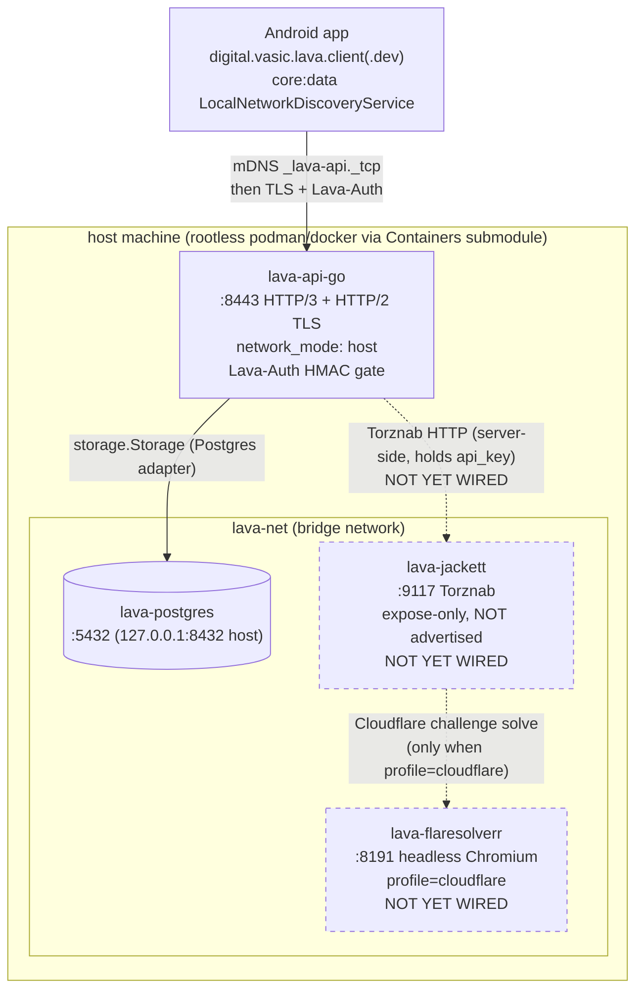
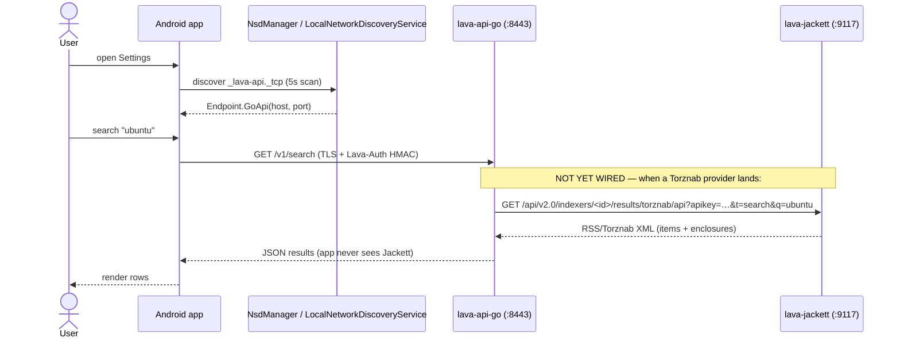
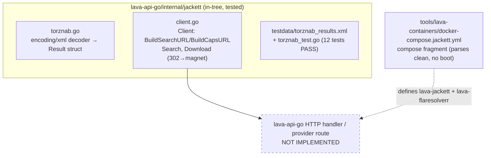
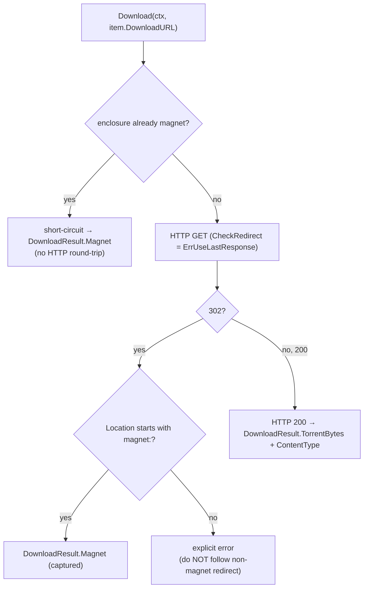
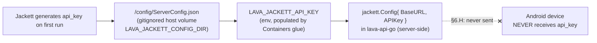

# Local-Stack Topology — Deployment Architecture

> **Status:** descriptive architecture reference. The Android client, the
> `lava-api-go` service, the root `docker-compose.yml`, and mDNS discovery are
> **in-tree and operational**. The **Jackett + FlareSolverr sidecar** is at
> **Phase 1** — the Torznab Go client + a compose fragment exist and are tested,
> but **no container has been booted** and **no `lava-api-go` handler routes
> through Jackett yet** (marked **NOT YET WIRED** below). Per HelixConstitution
> §11.4.6 (no-guessing vocabulary), the implemented-vs-pending split is read from
> source, not inferred.
>
> **Companion docs:**
> [`docs/qa/jackett-local-stack-research.md`](../qa/jackett-local-stack-research.md)
> (research dossier, every external claim cited),
> [`docs/qa/jackett-local-stack-implementation.md`](../qa/jackett-local-stack-implementation.md)
> (Phase 1 implementation + verbatim test output),
> [`docs/LOCAL_NETWORK_DISCOVERY.md`](../LOCAL_NETWORK_DISCOVERY.md) (mDNS),
> [`docs/architecture/tracker-sdk.md`](tracker-sdk.md) (client-side SDK).

---

## 1. The whole stack in one diagram

The load-bearing invariant: **the Android app only ever talks to
`lava-api-go`.** Jackett and FlareSolverr are server-side sidecars on the
internal `lava-net` bridge; they are never advertised on the LAN and never
reachable from the device. Credentials and the Jackett `api_key` stay
server-side (§6.H).



Dashed boxes/edges = **NOT YET WIRED** (Phase 1: client + compose fragment exist,
no boot, no handler). Solid = in-tree and operational.

Grounding:
- `network_mode: host` for `lava-api-go`, `lava-net` bridge for Postgres —
  `docker-compose.yml` (top comment: *"lava-api-go uses network_mode: host so
  JmDNS / mDNS advertisements reach the LAN; Postgres + observability containers
  use the lava-net bridge"*).
- mDNS `_lava-api._tcp`, `:8443` TLS, host-net — confirmed in
  `docs/qa/jackett-local-stack-research.md` §0 against
  `lava-api-go/cmd/lava-api-go/main.go` + `internal/config/config.go`.
- Postgres service name `lava-postgres`, host port `127.0.0.1:8432:5432` —
  `docker-compose.yml`.
- Jackett / FlareSolverr compose fragment —
  `tools/lava-containers/docker-compose.jackett.yml`
  (per `docs/qa/jackett-local-stack-implementation.md` Part 2).

---

## 2. The app sees ONE endpoint

The client's entire view of the backend is a single `_lava-api._tcp` (or
`_lava-api-dev._tcp` for dev) mDNS service that resolves to one
`Endpoint.GoApi(host, port)`. Jackett is invisible to the app by design — it is
a server-side capability that `lava-api-go` proxies over Torznab.



Security consequences (from research dossier §7 + implementation §"Ports
exposed to the LAN"):
- Neither `:9117` (Jackett) nor `:8191` (FlareSolverr) is published — they use
  `expose:` (intra-bridge only). Only `lava-api-go:8443` is LAN-visible.
- The discovery + auth model is unchanged: one endpoint, existing TLS + HMAC.
  `/health` and `/ready` answer without a credential so discovery probes work;
  any data endpoint returns 401 without the correct Lava-Auth key (see
  `docs/LOCAL_NETWORK_DISCOVERY.md` "Authentication when connecting").

---

## 3. mDNS discovery flow (in-tree, operational)

```mermaid
graph LR
    ADV["lava-api-go advertiser<br/>_lava-api._tcp<br/>(LAVA_API_MDNS_TYPE)"]
    SVC["LocalNetworkDiscoveryService<br/>core:data — NsdManager + callbackFlow"]
    UC["DiscoverLocalEndpointsUseCase<br/>core:domain — firstOrNull + timeout"]
    VM["MenuViewModel<br/>feature:menu"]
    UI["MenuScreen bottom sheet<br/>feature:menu"]

    ADV -->|"multicast 5353/UDP"| SVC
    SVC -->|"Flow&lt;DiscoveredEndpoint&gt;"| UC
    UC -->|"DiscoverLocalEndpointsResult"| VM
    VM -->|"MenuSideEffect.OpenConnectionSettings"| UI
```



Service types the client resolves (verbatim from
`docs/LOCAL_NETWORK_DISCOVERY.md`):

| Source | Service type | TXT records |
|---|---|---|
| Host server (release) | `_lava-api._tcp` | `engine=go`, `platform=server` (or absent) |
| Host server (dev) | `_lava-api-dev._tcp` | `engine=go-dev` |
| On-device app (release) | `_lava-api._tcp` | `engine=go`, `platform=android`, `storage=sqlite` |
| On-device app (dev) | `_lava-api-dev._tcp` | `engine=go-dev`, `platform=android`, `storage=sqlite` |

`LocalNetworkDiscoveryServiceImpl` resolves these to `Endpoint.GoApi(host, port)`
via the authoritative TXT `engine` attribute (falling back to the service type).
The on-device **advertiser** (a phone/tablet registering itself via `NsdManager`)
is **PENDING Phase D** — see `docs/ON_DEVICE_API.md`. Client-side discovery is
in-tree and unchanged.

---

## 4. Jackett sidecar — Phase 1 detail (NOT YET WIRED into a handler)

### 4.1 What exists today



Per `docs/qa/jackett-local-stack-implementation.md`:
- `internal/jackett/torznab.go` + `client.go` + `torznab_test.go` exist; the
  test suite reports `ok digital.vasic.lava.apigo/internal/jackett` (12 tests
  PASS, verbatim output in the implementation doc).
- `tools/lava-containers/docker-compose.jackett.yml` is a **fragment** merged at
  run time with the root `docker-compose.yml` via `-f`; it parses clean
  (`podman compose -f docker-compose.jackett.yml config --quiet`) but **no
  container was booted**.
- **NOT IMPLEMENTED:** the `lava-api-go` HTTP handler / provider route that calls
  `jackett.Client`, the OpenAPI spec entry, indexer provisioning automation, and
  `.env` / `.env.example` keys.

### 4.2 The 302 → magnet handler (the correctness-critical bit)

Jackett answers a download link with **HTTP 302 whose `Location` is a `magnet:`
URI**. A naive auto-following client tries to "`GET magnet:`" and fails.
`jackett.Client` sets `http.Client.CheckRedirect = http.ErrUseLastResponse`
(do **not** follow) and reads the `Location` header:



This serves the download-confirmation goal (a valid `.torrent` byte stream OR a
real magnet) and closes the known kinozal/nnmclub null-magnet gaps — and pairs
with the client-side `TorrentFileValidator` / `MagnetLinkValidator`
(`core/common/…/torrent/`, see [`tracker-sdk.md` §7](tracker-sdk.md)) so a
download is provably real on both sides of the boundary.

### 4.3 FlareSolverr — profile-gated

FlareSolverr (headless Chromium, the RAM-heavy component) is gated behind a
`cloudflare` compose profile so it is only up when a Cloudflare/DDoS-Guard
indexer (e.g. IPTorrents) is enabled. For RuTracker/RuTor/NNMClub it stays off.
Jackett points at it via a FlareSolverr URL in Jackett's config; readiness is
`POST :8191/v1 {"cmd":"sessions.list"}` → 200 (no native `/health`). Source:
research dossier §4.

### 4.4 Who holds the api_key



The api_key is a §6.H secret: read server-side at startup, **never** hardcoded
(§6.R), **never** sent to the device. Source:
`docs/qa/jackett-local-stack-implementation.md` "Who holds the apikey".

---

## 5. Orchestration — the Containers submodule

The stack is brought up by `tools/lava-containers/cmd/lava-containers` (thin
Lava-side glue), which auto-detects rootless podman/docker and merges the root
`docker-compose.yml` with fragments. The Jackett fragment composes in as:

```
docker compose -f docker-compose.yml \
  -f tools/lava-containers/docker-compose.jackett.yml \
  --profile api-go --profile jackett config
```

Generic container-runtime concerns are owned by the
`vasic-digital/Containers` submodule (`submodules/containers/`, pinned); the
local CLI is thin glue per the Decoupled Reusable Architecture rule. **Do not
bring `docker-compose.yml` up directly** — orchestration is owned by the CLI
(`start.sh` / `stop.sh`).

Compose profiles (from `docker-compose.yml` header):

| Profile | Brings up |
|---|---|
| `api-go` (default) | `lava-postgres` + `lava-migrate` + `lava-api-go` |
| `observability` | Prometheus + Loki + Promtail + Tempo + Grafana |
| `dev-docs` | Swagger UI mounting `api/openapi.yaml` |
| `jackett` (fragment) | `lava-jackett` (**NOT YET WIRED**) |
| `cloudflare` (fragment) | `lava-flaresolverr` (**NOT YET WIRED**) |

---

## 6. Healthchecks (§6.B — "Up" is not "healthy")

`docker ps` reporting `Up` only means PID 1 is alive. Each service has an
application-level probe:

| Service | Probe | Why |
|---|---|---|
| `lava-postgres` | `pg_isready -U lava -d lava_api` | DB accepting connections (`docker-compose.yml`). |
| `lava-api-go` | Dockerfile `HEALTHCHECK` → `healthprobe` (real HTTP/3) | distroless, no `/bin/sh`; §6.A contract test at `lava-api-go/tests/contract/healthcheck_contract_test.go`. |
| `lava-jackett` (planned) | Torznab `t=caps` 200 + parseable `<caps>` | proves the Torznab surface is live AND api_key is valid — the real code path `lava-api-go` will consume (not a bare TCP probe). |
| `lava-flaresolverr` (planned) | `POST /v1 {"cmd":"sessions.list"}` → 200 | no native `/health`; a bare TCP-8191 would accept the Python proxy before Chromium is ready. |

Any future Lava-owned `healthprobe`-style binary used for the Jackett probe
must gain a §6.A contract test asserting its flag set, mirroring
`healthcheck_contract_test.go` (research dossier §0 forensic anchor: the
569-consecutive-failing-healthcheck incident where the probe rejected a flag the
compose file passed).

---

## 7. Open questions (carried from the research dossier)

These are operator/architecture decisions, not yet resolved (verbatim from
`docs/qa/jackett-local-stack-research.md` §"OPEN QUESTIONS"):

- **Q1** — Jackett vs Prowlarr final call (Prowlarr only wins on provisioning
  automation; consumption surface is ~equal Torznab).
- **Q2** — Distribution mode for the Jackett image: reference `lscr.io/…` by
  digest vs. re-push into a Lava-owned registry (drives GPL-2.0 obligations).
- **Q3** — Indexer provisioning path: internal admin HTTP endpoints
  (version-coupled, undocumented) vs. per-`/config` JSON (undocumented schema).
- **Q4** — Jackett network mode: `lava-net` bridge (recommended) vs. host-net.
- **Q5** — FlareSolverr arm64 Chromium boot under the podman VM on Apple Silicon
  must be boot-verified before it is gate-eligible.

*Last updated: 2026-06-08. Implemented-vs-pending split verified against the
working tree + the qa/ Jackett docs.*
