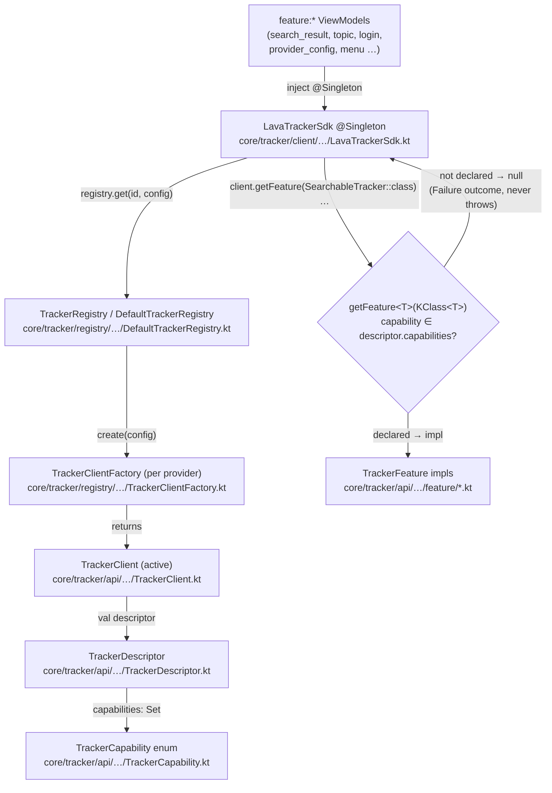
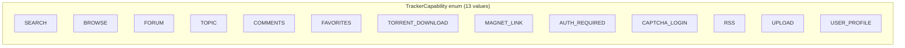
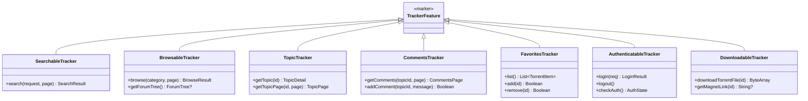
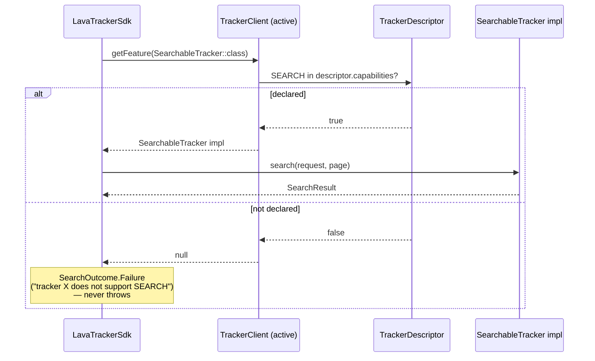
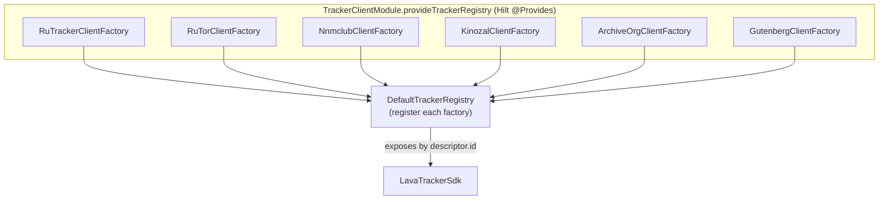
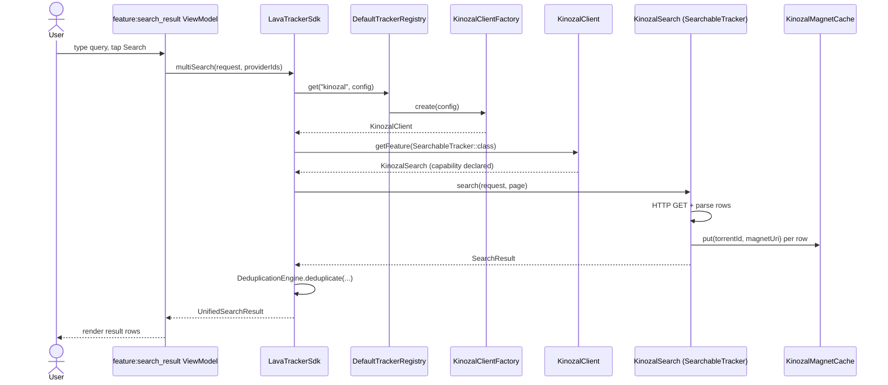
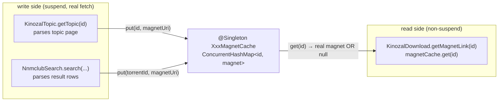
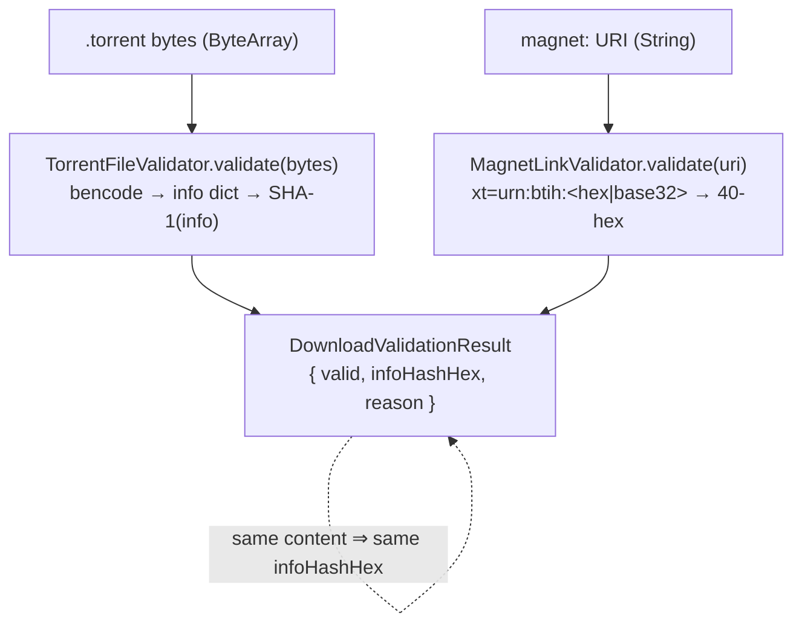
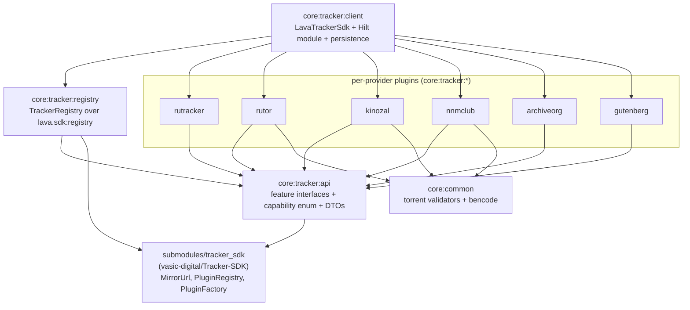

# Tracker SDK — Provider Abstraction Architecture

> **Status:** descriptive architecture reference. Every box, arrow, and symbol
> below corresponds to a real file in the working tree (cited inline). Anything
> not yet implemented is marked **NOT IMPLEMENTED**. Per HelixConstitution
> §11.4.6 (no-guessing vocabulary), nothing here is inferred — it is read from
> source.
>
> **Companion docs:** [`docs/ARCHITECTURE.md`](../ARCHITECTURE.md) (overview),
> [`docs/sdk-developer-guide.md`](../sdk-developer-guide.md) (the 7-step recipe
> + the magnet-cache + download-validator patterns),
> [`docs/architecture/local-stack-topology.md`](local-stack-topology.md)
> (server-side deployment).

---

## 1. The abstraction in one diagram

The Tracker SDK is a capability-gated plugin system. A feature ViewModel talks
only to `LavaTrackerSdk`; the SDK routes the call through the active tracker's
`TrackerClient.getFeature<T>()`, which returns a feature-interface
implementation **only when the descriptor declares the matching capability**
(constitutional clause 6.E, "Capability Honesty").



Grounding:
- `LavaTrackerSdk` — `core/tracker/client/src/main/kotlin/lava/tracker/client/LavaTrackerSdk.kt`
- `TrackerClient.getFeature` — `core/tracker/api/src/main/kotlin/lava/tracker/api/TrackerClient.kt`
- `TrackerDescriptor` — `core/tracker/api/src/main/kotlin/lava/tracker/api/TrackerDescriptor.kt`
- `TrackerCapability` — `core/tracker/api/src/main/kotlin/lava/tracker/api/TrackerCapability.kt`
- `TrackerClientFactory` / `DefaultTrackerRegistry` — `core/tracker/registry/src/main/kotlin/lava/tracker/registry/`

---

## 2. The contract surface (`core:tracker:api`)

### 2.1 `TrackerDescriptor`

A descriptor is the provider's identity + honesty contract. The fields below are
verbatim from `TrackerDescriptor.kt`:

| Field | Type | Meaning |
|---|---|---|
| `trackerId` (= `id`) | `String` | Stable id, e.g. `"rutracker"`, `"rutor"`, `"kinozal"`, `"nnmclub"`. Extends `lava.sdk.api.HasId`. |
| `displayName` | `String` | Human-readable name shown in UI. |
| `baseUrls` | `List<MirrorUrl>` | Primary + mirror URLs; first `isPrimary=true` is canonical. `MirrorUrl` is a `lava.sdk.api` primitive from the Tracker-SDK submodule. |
| `capabilities` | `Set<TrackerCapability>` | What the tracker **actually** supports (clause 6.E — declarations of fact, not intent). |
| `authType` | `AuthType` | Auth mechanism (`AuthType.kt`). |
| `encoding` | `String` | e.g. `"UTF-8"`, `"Windows-1251"`. |
| `expectedHealthMarker` | `String` | Substring that must appear on the root page for a HEALTHY probe. |
| `verified` | `Boolean` (default `false`) | Clause 6.G gate — `true` only with a passing Challenge Test. Fail-closed: hidden from the provider list until earned. |
| `supportsAnonymous` | `Boolean` (default `false`) | Per-provider anonymous-browse capability (Phase 1.5, 2026-05-04). |
| `apiSupported` | `Boolean` (default `false`) | Whether `lava-api-go` routes `/v1/{trackerId}/…` for this provider today (Phase 1 α-hotfix, 2026-05-06). |

The three boolean flags (`verified`, `supportsAnonymous`, `apiSupported`) all
default to `false` — a **fail-closed** posture so a half-wired provider never
reaches users until each gate is explicitly satisfied.

### 2.2 `TrackerCapability` — the single source of truth



Verbatim from `TrackerCapability.kt`: `SEARCH, BROWSE, FORUM, TOPIC, COMMENTS,
FAVORITES, TORRENT_DOWNLOAD, MAGNET_LINK, AUTH_REQUIRED, CAPTCHA_LOGIN, RSS,
UPLOAD, USER_PROFILE`.

The enum is the **single source of truth** that `TrackerDescriptor.capabilities`
and `TrackerClient.getFeature<T>()` are gated on. Adding a feature interface
without an enum entry makes the interface unreachable — a 6.E violation
(see `core/CLAUDE.md` "Scoped clause for new feature interfaces").

> **Note on `RSS`, `UPLOAD`, `USER_PROFILE`:** these enum values exist but have
> **no dedicated `TrackerFeature` interface** in `core/tracker/api/feature/`
> today — they are reserved capability slots, **NOT IMPLEMENTED** as feature
> interfaces. The seven implemented feature interfaces are listed in §2.3.

### 2.3 The seven feature interfaces

Each interface extends the `TrackerFeature` marker
(`core/tracker/api/…/TrackerFeature.kt`). Method signatures are verbatim from
`core/tracker/api/src/main/kotlin/lava/tracker/api/feature/`:



| Interface | File | Capability it answers |
|---|---|---|
| `SearchableTracker` | `feature/SearchableTracker.kt` | `SEARCH` |
| `BrowsableTracker` | `feature/BrowsableTracker.kt` | `BROWSE` / `FORUM` |
| `TopicTracker` | `feature/TopicTracker.kt` | `TOPIC` |
| `CommentsTracker` | `feature/CommentsTracker.kt` | `COMMENTS` |
| `FavoritesTracker` | `feature/FavoritesTracker.kt` | `FAVORITES` |
| `AuthenticatableTracker` | `feature/AuthenticatableTracker.kt` | `AUTH_REQUIRED` / `CAPTCHA_LOGIN` |
| `DownloadableTracker` | `feature/DownloadableTracker.kt` | `TORRENT_DOWNLOAD` / `MAGNET_LINK` |

`DownloadableTracker.getMagnetLink(id)` is the **only non-suspend** method on any
feature interface, and its contract ("Returns null if the magnet URI is not
synchronously available without an HTTP fetch") is the reason the per-provider
**magnet-cache pattern** exists — see §6 and the developer guide.

---

## 3. Capability gate — `getFeature<T>()`

`TrackerClient` (`core/tracker/api/…/TrackerClient.kt`) is the runtime
enforcement point for clause 6.E:

```kotlin
interface TrackerClient : AutoCloseable {
    val descriptor: TrackerDescriptor
    suspend fun healthCheck(): Boolean
    fun <T : TrackerFeature> getFeature(featureClass: KClass<T>): T?
}
```

The contract, stated in the interface's KDoc: *"capability declared in
descriptor ⇒ this returns non-null."* The inverse is the load-bearing honesty
guarantee — a capability **not** declared returns `null`, and every SDK call
site treats `null` as a typed failure outcome rather than throwing.



This pattern repeats for every capability across `LavaTrackerSdk`
(`search`, `browse`, `getTopic`, `getCommentsPage`, `addComment`,
`getFavorites`, `addFavorite`, `removeFavorite`, `login`, `checkAuth`,
`logout`, `getMagnetLink`, `downloadTorrent`) — each does a `getFeature(...)`
null-check and returns a `Failure`/`null`/`false` outcome instead of throwing
(`LavaTrackerSdk.kt`).

---

## 4. Registry + factory — how a provider gets wired

### 4.1 Registration topology (Hilt, `core:tracker:client`)

There is **one** Hilt module that builds the registry:
`core/tracker/client/src/main/kotlin/lava/tracker/client/di/TrackerClientModule.kt`.
Its `provideTrackerRegistry` `@Provides` function takes every provider's
`TrackerClientFactory` as a constructor parameter and `register(...)`s each into
a `DefaultTrackerRegistry`:



The six factories registered today (verbatim from `TrackerClientModule.kt`
`provideTrackerRegistry`): `rutrackerFactory`, `rutorFactory`, `nnmclubFactory`,
`kinozalFactory`, `archiveOrgFactory`, `gutenbergFactory`.

> **Doc-drift note:** `docs/sdk-developer-guide.md` §2 Step 5 still describes a
> `@IntoSet`-multibinding registration style and §5 lists only RuTracker + RuTor.
> The **actual** wiring in `TrackerClientModule.kt` is explicit constructor
> injection of six factories into `provideTrackerRegistry` (no `@IntoSet`). This
> diagram reflects the code. The guide's Step 5 is documentation that predates
> the additional providers.

### 4.2 `TrackerClientFactory` — clone-aware creation

`TrackerClientFactory` (`core/tracker/registry/…/TrackerClientFactory.kt`)
extends the SDK primitive `PluginFactory<TrackerDescriptor, TrackerClient>` and
exposes `create(config: PluginConfig): TrackerClient`.

The `config` carries an optional clone base-URL override
(`PluginConfig.cloneBaseUrlOverride`, read via
`lava.tracker.registry.cloneBaseUrlOverride`). When present (SP-4 Phase F.2),
`create` returns a **per-call** client routed at the clone's `primaryUrl`;
otherwise it returns the shared `@Singleton` client. See
`KinozalClientFactory.kt` for the canonical implementation — note it shares ONE
`KinozalMagnetCache` between the clone's topic + download features (§6).

---

## 5. Request flow: app → SDK → client → feature

End-to-end search flow through the production classes:



Grounding for the multi-provider path: `LavaTrackerSdk.multiSearch` /
`streamMultiSearch` fan out across `providerIds` with parallel
`async { … }.awaitAll()` (SP-4 Phase D), roll up per-provider statuses, and
deduplicate via `DeduplicationEngine`
(`core/tracker/client/…/dedup/DeduplicationEngine.kt`). The magnet-cache write
on each search row (`S->>MC: put`) is the real code in `NnmclubSearch.kt`
(`result.items.forEach { magnetCache.put(it.torrentId, it.magnetUri) }`).

### Cross-tracker / mirror fallback

The single-active-tracker path (`search`, `browse`) additionally runs through
`runWithMirrorFallback`, which (when mirror collaborators are wired) executes via
a per-tracker `MirrorManager` and, on total mirror exhaustion, proposes a
`CrossTrackerFallbackProposed` outcome via `CrossTrackerFallbackPolicy`
(`core/tracker/client/…/CrossTrackerFallbackPolicy.kt`). There is **no silent
fallback** — the UI shows a modal and the user accepts or dismisses (see
`docs/ARCHITECTURE.md` "Cross-tracker fallback flow").

> The `switchTracker` / `activeTrackerId` single-active-tracker API is
> `@Deprecated` (SP-4 Phase D) in favor of `multiSearch` / `streamMultiSearch`
> with explicit provider lists (`LavaTrackerSdk.kt`).

---

## 6. The magnet-cache pattern (§6.E Capability Honesty)

`DownloadableTracker.getMagnetLink(id)` is **non-suspend**, so it cannot make an
HTTP call. Its contract is to return the magnet **only if synchronously
available**, else `null`. Three providers (kinozal, nnmclub, rutor) declare the
`MAGNET_LINK` capability and back `getMagnetLink` with a `@Singleton` magnet
cache that the suspend topic/search path populates from genuinely-parsed
magnets:



Real files implementing this pattern:

| Provider | Cache | Writer(s) | Reader |
|---|---|---|---|
| Kinozal | `kinozal/…/magnet/KinozalMagnetCache.kt` | `KinozalTopic.getTopic` | `KinozalDownload.getMagnetLink` |
| NNM-Club | `nnmclub/…/http/NnmclubMagnetCache.kt` | `NnmclubTopic`, `NnmclubSearch` | `NnmclubDownload.getMagnetLink` |
| RuTor | `rutor/…/magnet/RuTorMagnetCache.kt` | RuTor topic/search parsers | RuTor download feature |

Why this is honest rather than a bluff: `get(id)` returns `null` when an id was
never surfaced (an honest "not synchronously available" per the contract), and
the cache is only ever populated with magnets that the **production parser**
extracted from a real page — never fabricated. The cache is a
`ConcurrentHashMap` (search + topic features may write from different coroutines
while download reads). It is `@Singleton` so all features share one instance;
the clone path passes an explicit shared instance (`KinozalClientFactory.create`,
§4.2).

The full author-facing recipe — including the `put`-on-parse wiring and the
clone-path shared-instance rule — is documented in
[`docs/sdk-developer-guide.md` §8](../sdk-developer-guide.md).

---

## 7. Proving a download is real — the torrent validators

`core:common` ships two validators (`core/common/src/main/kotlin/lava/common/torrent/`)
that turn "we returned bytes / a string" into "we returned a genuinely-usable
download". Both produce a `DownloadValidationResult { valid, infoHashHex, reason }`
keyed on the **same** lowercase 40-char info-hash, so a `.torrent` file and a
magnet for the same content cross-check.



- **`TorrentFileValidator`** — parses the bytes as bencode (`Bencode.kt`),
  requires a top-level dict containing `info` with a non-empty `name`, a
  `piece length > 0`, and `pieces` whose length is a positive multiple of 20
  (each piece SHA-1 is 20 bytes). The info-hash is `SHA-1` over the **verbatim**
  bencoded `info` dict bytes (recovered via `valueRanges`), so it matches what a
  real BitTorrent client computes.
- **`MagnetLinkValidator`** — requires an `xt=urn:btih:<hash>` where `<hash>` is
  40-char hex OR 32-char RFC-4648 base32; normalizes both to lowercase hex.

These are the canonical anti-bluff way to assert a download feature actually
works (clause 6.E + the Anti-Bluff Pact's "primary assertion on user-visible
state"). See [`docs/sdk-developer-guide.md` §9](../sdk-developer-guide.md).

---

## 8. Module layout



Generic primitives (`MirrorUrl`, `PluginRegistry`, `PluginFactory`,
`MapPluginConfig`) live in the `vasic-digital/Tracker-SDK` submodule mounted at
`submodules/tracker_sdk/` per the Decoupled Reusable Architecture rule; the pin
is frozen by default. `DefaultTrackerRegistry` composes the SDK's
`DefaultPluginRegistry` via Kotlin interface delegation (the SDK class is final)
and adds `trackersWithCapability(...)`.

---

## 9. Where to go next

- **Add a provider:** [`docs/sdk-developer-guide.md`](../sdk-developer-guide.md)
  (7-step recipe + §8 magnet cache + §9 validators).
- **Server-side deployment / Jackett:**
  [`docs/architecture/local-stack-topology.md`](local-stack-topology.md).
- **mDNS discovery:** [`docs/LOCAL_NETWORK_DISCOVERY.md`](../LOCAL_NETWORK_DISCOVERY.md).

*Last updated: 2026-06-08. All symbols verified against the working tree.*
