# Lava Database Schemas

Lava has **two independent databases**:

1. **Client (Android) — Room/SQLite**, `lava.database.AppDatabase`,
   schema **version 11**. The authoritative dump is the Room schema JSON at
   [`core/database/schemas/lava.database.AppDatabase/11.json`](../../core/database/schemas/lava.database.AppDatabase/11.json)
   (identity hash `72458bec62ab2a038aeb36fbfe05129d`). Every column / type /
   key below is taken verbatim from that file.

2. **Server (lava-api-go) — Postgres**, schema `lava_api`, managed by
   golang-migrate SQL files
   [`lava-api-go/migrations/0001..0009`](../../lava-api-go/migrations/).
   Every column / type / key below is taken verbatim from the `*.up.sql` files.

These two schemas are **not** mirrors of each other. They overlap on a small
number of conceptual entities (provider config/credentials, provider
selections) which evolved on both sides; see §3 (Parity) for the overlap.

---

## 1. Client schema (Room / SQLite, version 11)

Room affinity → SQLite type: `TEXT`, `INTEGER`, `BLOB`. `notNull: true` =
`NOT NULL`. Nullable columns omit the flag.

### 1.1 ER diagram (client)

The only declared relationship is `ForumCategoryEntity`'s self-referential
`parentId → id` foreign key (`ON DELETE CASCADE`). All other tables are
standalone (Room stores related data as serialized `TEXT`, e.g.
`Bookmark.topics`, rather than via FKs).

```mermaid
erDiagram
    ForumCategoryEntity ||--o{ ForumCategoryEntity : "parentId (CASCADE)"

    Bookmark {
        TEXT id PK
        INTEGER timestamp
        TEXT category
        TEXT topics
        TEXT newTopics
    }
    cloned_provider {
        TEXT syntheticId PK
        TEXT sourceTrackerId
        TEXT displayName
        TEXT primaryUrl
        INTEGER deletedAt "nullable"
    }
    credentials_entry {
        TEXT id PK
        TEXT displayName
        TEXT type
        BLOB ciphertext
        INTEGER createdAt
        INTEGER updatedAt
        INTEGER deletedAt "nullable"
    }
    Endpoint {
        TEXT id PK
        TEXT type
        TEXT host
    }
    FavoriteSearch {
        INTEGER id PK
    }
    FavoriteTopic {
        TEXT id PK
        INTEGER timestamp
        TEXT title
        TEXT author "nullable"
        TEXT category "nullable"
        TEXT tags "nullable"
        TEXT status "nullable"
        INTEGER date "nullable"
        TEXT size "nullable"
        INTEGER seeds "nullable"
        INTEGER leeches "nullable"
        TEXT magnetLink "nullable"
        INTEGER hasUpdate
    }
    ForumCategoryEntity {
        TEXT id PK
        TEXT name
        TEXT parentId FK "nullable"
        INTEGER orderIndex
    }
    ForumMetadata {
        INTEGER id PK
        INTEGER lastUpdatedTimestamp
    }
    forum_provider_selections {
        INTEGER id PK "autoincrement"
        TEXT category_id
        TEXT provider_id
        INTEGER created_at
    }
    tracker_mirror_health {
        TEXT tracker_id PK
        TEXT mirror_url PK
        TEXT state
        INTEGER last_check_at "nullable"
        INTEGER consecutive_failures
    }
    provider_configs {
        TEXT provider_id PK
        INTEGER timeout_ms
        TEXT preferred_mirror_url "nullable"
        INTEGER is_enabled
        INTEGER search_enabled
        INTEGER browse_enabled
        INTEGER download_enabled
        INTEGER use_anonymous
        TEXT sort_preference "nullable"
        INTEGER updated_at
    }
    provider_credential_binding {
        TEXT providerId PK
        TEXT credentialId
    }
    provider_credentials {
        TEXT provider_id PK
        TEXT auth_type
        TEXT username "nullable"
        TEXT encrypted_password "nullable"
        TEXT encrypted_token "nullable"
        TEXT encrypted_api_key "nullable"
        TEXT encrypted_api_secret "nullable"
        TEXT cookie_value "nullable"
        INTEGER expires_at "nullable"
        INTEGER is_active
        INTEGER last_used_at "nullable"
        INTEGER created_at
        INTEGER updated_at
    }
    provider_sync_toggle {
        TEXT providerId PK
        INTEGER enabled
    }
    Search {
        INTEGER id PK
        INTEGER timestamp
        TEXT query "nullable"
        TEXT sort
        TEXT order
        TEXT period
        TEXT author "nullable"
        TEXT categories "nullable"
    }
    search_provider_selections {
        INTEGER id PK "autoincrement"
        TEXT query_hash
        TEXT provider_id
        INTEGER is_selected
        INTEGER created_at
    }
    Suggest {
        INTEGER id PK
        INTEGER timestamp
        TEXT suggest
    }
    sync_outbox {
        INTEGER id PK "autoincrement"
        TEXT kind
        TEXT payload
        INTEGER createdAt
    }
    tracker_mirror_user {
        TEXT tracker_id PK
        TEXT url PK
        INTEGER priority
        TEXT protocol
        INTEGER added_at
    }
    HistoryTopic {
        TEXT id PK
        INTEGER timestamp
        TEXT title
        TEXT author "nullable"
        TEXT category "nullable"
        TEXT tags "nullable"
        TEXT status "nullable"
        INTEGER date "nullable"
        TEXT size "nullable"
        INTEGER seeds "nullable"
        INTEGER leeches "nullable"
        TEXT magnetLink "nullable"
    }
```

### 1.2 Tables (client) — column listing

All columns below are exactly as declared in `11.json`.

#### `Bookmark` — PK `id`
| Column | Affinity | Not null |
| --- | --- | --- |
| id | TEXT | yes |
| timestamp | INTEGER | yes |
| category | TEXT | yes |
| topics | TEXT | yes |
| newTopics | TEXT | yes |

#### `cloned_provider` — PK `syntheticId`
| Column | Affinity | Not null |
| --- | --- | --- |
| syntheticId | TEXT | yes |
| sourceTrackerId | TEXT | yes |
| displayName | TEXT | yes |
| primaryUrl | TEXT | yes |
| deletedAt | INTEGER | no |

#### `credentials_entry` — PK `id`
| Column | Affinity | Not null |
| --- | --- | --- |
| id | TEXT | yes |
| displayName | TEXT | yes |
| type | TEXT | yes |
| ciphertext | BLOB | yes |
| createdAt | INTEGER | yes |
| updatedAt | INTEGER | yes |
| deletedAt | INTEGER | no |

#### `Endpoint` — PK `id`
| Column | Affinity | Not null |
| --- | --- | --- |
| id | TEXT | yes |
| type | TEXT | yes |
| host | TEXT | yes |

#### `FavoriteSearch` — PK `id`
| Column | Affinity | Not null |
| --- | --- | --- |
| id | INTEGER | yes |

#### `FavoriteTopic` — PK `id`
| Column | Affinity | Not null |
| --- | --- | --- |
| id | TEXT | yes |
| timestamp | INTEGER | yes |
| title | TEXT | yes |
| author | TEXT | no |
| category | TEXT | no |
| tags | TEXT | no |
| status | TEXT | no |
| date | INTEGER | no |
| size | TEXT | no |
| seeds | INTEGER | no |
| leeches | INTEGER | no |
| magnetLink | TEXT | no |
| hasUpdate | INTEGER | yes |

#### `ForumCategoryEntity` — PK `id`; FK `parentId → ForumCategoryEntity.id` (ON DELETE CASCADE); index on `parentId`
| Column | Affinity | Not null |
| --- | --- | --- |
| id | TEXT | yes |
| name | TEXT | yes |
| parentId | TEXT | no |
| orderIndex | INTEGER | yes |

#### `ForumMetadata` — PK `id`
| Column | Affinity | Not null |
| --- | --- | --- |
| id | INTEGER | yes |
| lastUpdatedTimestamp | INTEGER | yes |

#### `forum_provider_selections` — PK `id` (AUTOINCREMENT)
| Column | Affinity | Not null |
| --- | --- | --- |
| id | INTEGER | yes |
| category_id | TEXT | yes |
| provider_id | TEXT | yes |
| created_at | INTEGER | yes |

#### `tracker_mirror_health` — composite PK (`tracker_id`, `mirror_url`)
| Column | Affinity | Not null |
| --- | --- | --- |
| tracker_id | TEXT | yes |
| mirror_url | TEXT | yes |
| state | TEXT | yes |
| last_check_at | INTEGER | no |
| consecutive_failures | INTEGER | yes |

#### `provider_configs` — PK `provider_id`
| Column | Affinity | Not null |
| --- | --- | --- |
| provider_id | TEXT | yes |
| timeout_ms | INTEGER | yes |
| preferred_mirror_url | TEXT | no |
| is_enabled | INTEGER | yes |
| search_enabled | INTEGER | yes |
| browse_enabled | INTEGER | yes |
| download_enabled | INTEGER | yes |
| use_anonymous | INTEGER | yes |
| sort_preference | TEXT | no |
| updated_at | INTEGER | yes |

#### `provider_credential_binding` — PK `providerId`
| Column | Affinity | Not null |
| --- | --- | --- |
| providerId | TEXT | yes |
| credentialId | TEXT | yes |

#### `provider_credentials` — PK `provider_id`
| Column | Affinity | Not null |
| --- | --- | --- |
| provider_id | TEXT | yes |
| auth_type | TEXT | yes |
| username | TEXT | no |
| encrypted_password | TEXT | no |
| encrypted_token | TEXT | no |
| encrypted_api_key | TEXT | no |
| encrypted_api_secret | TEXT | no |
| cookie_value | TEXT | no |
| expires_at | INTEGER | no |
| is_active | INTEGER | yes |
| last_used_at | INTEGER | no |
| created_at | INTEGER | yes |
| updated_at | INTEGER | yes |

#### `provider_sync_toggle` — PK `providerId`
| Column | Affinity | Not null |
| --- | --- | --- |
| providerId | TEXT | yes |
| enabled | INTEGER | yes |

#### `Search` — PK `id`
| Column | Affinity | Not null |
| --- | --- | --- |
| id | INTEGER | yes |
| timestamp | INTEGER | yes |
| query | TEXT | no |
| sort | TEXT | yes |
| order | TEXT | yes |
| period | TEXT | yes |
| author | TEXT | no |
| categories | TEXT | no |

#### `search_provider_selections` — PK `id` (AUTOINCREMENT)
| Column | Affinity | Not null |
| --- | --- | --- |
| id | INTEGER | yes |
| query_hash | TEXT | yes |
| provider_id | TEXT | yes |
| is_selected | INTEGER | yes |
| created_at | INTEGER | yes |

#### `Suggest` — PK `id`
| Column | Affinity | Not null |
| --- | --- | --- |
| id | INTEGER | yes |
| timestamp | INTEGER | yes |
| suggest | TEXT | yes |

#### `sync_outbox` — PK `id` (AUTOINCREMENT)
| Column | Affinity | Not null |
| --- | --- | --- |
| id | INTEGER | yes |
| kind | TEXT | yes |
| payload | TEXT | yes |
| createdAt | INTEGER | yes |

#### `tracker_mirror_user` — composite PK (`tracker_id`, `url`)
| Column | Affinity | Not null |
| --- | --- | --- |
| tracker_id | TEXT | yes |
| url | TEXT | yes |
| priority | INTEGER | yes |
| protocol | TEXT | yes |
| added_at | INTEGER | yes |

#### `HistoryTopic` — PK `id`
| Column | Affinity | Not null |
| --- | --- | --- |
| id | TEXT | yes |
| timestamp | INTEGER | yes |
| title | TEXT | yes |
| author | TEXT | no |
| category | TEXT | no |
| tags | TEXT | no |
| status | TEXT | no |
| date | INTEGER | no |
| size | TEXT | no |
| seeds | INTEGER | no |
| leeches | INTEGER | no |
| magnetLink | TEXT | no |

> Room schema JSONs for all migration versions are checked in under
> `core/database/schemas/lava.database.AppDatabase/`. The build verifies that
> migrations between consecutive versions reproduce the next version's schema.

---

## 2. Server schema (Postgres, schema `lava_api`)

Tables live in the `lava_api` schema (created by migration 0001). Source files:
[`lava-api-go/migrations/`](../../lava-api-go/migrations/). The one-shot
`lava-migrate` compose service applies them with golang-migrate (see
[`docs/deployment/README.md`](../deployment/README.md)).

Migration history:

| Migration | Table / change |
| --- | --- |
| 0001 | `response_cache` (initial) + `lava_api` schema |
| 0002 | `request_audit` |
| 0003 | `rate_limit_bucket` |
| 0004 | `login_attempt` |
| 0005 | `response_cache` realign (DROP + re-CREATE; destructive on existing DBs) |
| 0006 | `provider_credentials` |
| 0007 | `provider_configs` |
| 0008 | `search_provider_selections` |
| 0009 | `forum_provider_selections` |

### 2.1 ER diagram (server)

No foreign keys are declared between these tables; each is standalone. The
diagram lists the post-migration column shape (`response_cache` as realigned by
0005).

```mermaid
erDiagram
    response_cache {
        TEXT cache_key PK
        BYTEA value
        TIMESTAMPTZ expires_at "nullable"
    }
    request_audit {
        BIGSERIAL id PK
        TIMESTAMPTZ received_at
        TEXT method
        TEXT path
        TEXT query "nullable"
        INET client_ip "nullable"
        TEXT auth_realm_hash "nullable"
        SMALLINT upstream_status "nullable"
        INTEGER upstream_ms "nullable"
        TEXT cache_outcome
        INTEGER bytes_out "nullable"
    }
    rate_limit_bucket {
        INET client_ip PK
        TEXT route_class PK
        DOUBLE tokens
        TIMESTAMPTZ last_refill_at
    }
    login_attempt {
        BIGSERIAL id PK
        INET client_ip
        TEXT username_hash
        BOOLEAN succeeded
        TIMESTAMPTZ attempted_at
    }
    provider_credentials {
        TEXT provider_id PK
        TEXT auth_type
        TEXT username "nullable"
        TEXT encrypted_password "nullable"
        TEXT encrypted_token "nullable"
        TEXT encrypted_api_key "nullable"
        TEXT encrypted_api_secret "nullable"
        TEXT cookie_value "nullable"
        TIMESTAMPTZ expires_at "nullable"
        BOOLEAN is_active
        TIMESTAMPTZ last_used_at "nullable"
        TIMESTAMPTZ created_at
        TIMESTAMPTZ updated_at
    }
    provider_configs {
        TEXT provider_id PK
        INTEGER timeout_ms
        TEXT preferred_mirror_url "nullable"
        BOOLEAN is_enabled
        BOOLEAN search_enabled
        BOOLEAN browse_enabled
        BOOLEAN download_enabled
        TEXT sort_preference "nullable"
        TIMESTAMPTZ updated_at
    }
    search_provider_selections {
        BIGSERIAL id PK
        TEXT query_hash UK
        TEXT provider_id UK
        BOOLEAN is_selected
        TIMESTAMPTZ created_at
    }
    forum_provider_selections {
        BIGSERIAL id PK
        TEXT category_id UK
        TEXT provider_id UK
        TIMESTAMPTZ created_at
    }
```

### 2.2 Tables (server) — column listing

#### `lava_api.response_cache` — PK `cache_key` (post-0005 shape)
| Column | Type | Constraint |
| --- | --- | --- |
| cache_key | TEXT | PRIMARY KEY |
| value | BYTEA | NOT NULL |
| expires_at | TIMESTAMPTZ | — |

Index: `response_cache_expires_at_idx` on `expires_at`. The
`submodules/cache/pkg/postgres` library has these three column names hardcoded
in its INSERT/SELECT (see the comment block in 0001/0005).

#### `lava_api.request_audit` — PK `id`
| Column | Type | Constraint |
| --- | --- | --- |
| id | BIGSERIAL | PRIMARY KEY |
| received_at | TIMESTAMPTZ | NOT NULL DEFAULT now() |
| method | TEXT | NOT NULL |
| path | TEXT | NOT NULL |
| query | TEXT | — |
| client_ip | INET | — |
| auth_realm_hash | TEXT | — |
| upstream_status | SMALLINT | — |
| upstream_ms | INTEGER | — |
| cache_outcome | TEXT | NOT NULL |
| bytes_out | INTEGER | — |

Index: `request_audit_received_at_idx` on `received_at`.

#### `lava_api.rate_limit_bucket` — composite PK (`client_ip`, `route_class`)
| Column | Type | Constraint |
| --- | --- | --- |
| client_ip | INET | NOT NULL, PK |
| route_class | TEXT | NOT NULL, PK |
| tokens | DOUBLE PRECISION | NOT NULL |
| last_refill_at | TIMESTAMPTZ | NOT NULL |

#### `lava_api.login_attempt` — PK `id`
| Column | Type | Constraint |
| --- | --- | --- |
| id | BIGSERIAL | PRIMARY KEY |
| client_ip | INET | NOT NULL |
| username_hash | TEXT | NOT NULL |
| succeeded | BOOLEAN | NOT NULL |
| attempted_at | TIMESTAMPTZ | NOT NULL DEFAULT now() |

Index: `login_attempt_lookup_idx` on (`client_ip`, `attempted_at DESC`).

#### `lava_api.provider_credentials` — PK `provider_id`
| Column | Type | Constraint |
| --- | --- | --- |
| provider_id | TEXT | PRIMARY KEY |
| auth_type | TEXT | NOT NULL DEFAULT 'none' |
| username | TEXT | — |
| encrypted_password | TEXT | — |
| encrypted_token | TEXT | — |
| encrypted_api_key | TEXT | — |
| encrypted_api_secret | TEXT | — |
| cookie_value | TEXT | — |
| expires_at | TIMESTAMPTZ | — |
| is_active | BOOLEAN | NOT NULL DEFAULT true |
| last_used_at | TIMESTAMPTZ | — |
| created_at | TIMESTAMPTZ | NOT NULL DEFAULT now() |
| updated_at | TIMESTAMPTZ | NOT NULL DEFAULT now() |

Index: `provider_credentials_active_idx` on (`is_active`, `updated_at DESC`).

#### `lava_api.provider_configs` — PK `provider_id`
| Column | Type | Constraint |
| --- | --- | --- |
| provider_id | TEXT | PRIMARY KEY |
| timeout_ms | INTEGER | NOT NULL DEFAULT 10000 |
| preferred_mirror_url | TEXT | — |
| is_enabled | BOOLEAN | NOT NULL DEFAULT true |
| search_enabled | BOOLEAN | NOT NULL DEFAULT true |
| browse_enabled | BOOLEAN | NOT NULL DEFAULT true |
| download_enabled | BOOLEAN | NOT NULL DEFAULT true |
| sort_preference | TEXT | — |
| updated_at | TIMESTAMPTZ | NOT NULL DEFAULT now() |

#### `lava_api.search_provider_selections` — PK `id`
| Column | Type | Constraint |
| --- | --- | --- |
| id | BIGSERIAL | PRIMARY KEY |
| query_hash | TEXT | NOT NULL |
| provider_id | TEXT | NOT NULL |
| is_selected | BOOLEAN | NOT NULL DEFAULT true |
| created_at | TIMESTAMPTZ | NOT NULL DEFAULT now() |

Constraints: `UNIQUE (query_hash, provider_id)`; index
`search_provider_selections_query_idx` on `query_hash`.

#### `lava_api.forum_provider_selections` — PK `id`
| Column | Type | Constraint |
| --- | --- | --- |
| id | BIGSERIAL | PRIMARY KEY |
| category_id | TEXT | NOT NULL |
| provider_id | TEXT | NOT NULL |
| created_at | TIMESTAMPTZ | NOT NULL DEFAULT now() |

Constraints: `UNIQUE (category_id, provider_id)`; index
`forum_provider_selections_category_idx` on `category_id`.

---

## 3. Room ↔ Postgres parity

The two databases serve different roles: the Room DB is the on-device client
cache/state; the Postgres DB is the server-side cache/audit/credential store.
Most tables exist on only one side. The conceptually overlapping entities:

| Entity | Client (Room) | Server (Postgres) | Notes |
| --- | --- | --- | --- |
| `provider_configs` | yes (PK `provider_id`) | yes (PK `provider_id`) | Same intent (per-provider toggles + timeout + preferred mirror). **Column drift:** the Room table has `use_anonymous` (INTEGER, NOT NULL) which the Postgres table does **not** have (migration 0007 predates it). Both have `is_enabled`/`search_enabled`/`browse_enabled`/`download_enabled`/`sort_preference`/`updated_at`. Types differ by platform (Room INTEGER booleans vs Postgres BOOLEAN; INTEGER epoch vs TIMESTAMPTZ). |
| `provider_credentials` | yes (PK `provider_id`) | yes (PK `provider_id`) | Same column set and intent (`auth_type`, `username`, `encrypted_*`, `cookie_value`, `expires_at`, `is_active`, `last_used_at`, `created_at`, `updated_at`). Type encoding differs by platform (Room TEXT/INTEGER vs Postgres TEXT/TIMESTAMPTZ/BOOLEAN). |
| `search_provider_selections` | yes (PK `id` AUTOINCREMENT) | yes (PK `id` BIGSERIAL) | Same intent (per-query provider selection). Both carry `query_hash`, `provider_id`, `is_selected`, `created_at`. The Postgres side adds a `UNIQUE (query_hash, provider_id)`; the Room JSON declares no equivalent unique index. |
| `forum_provider_selections` | yes (PK `id` AUTOINCREMENT) | yes (PK `id` BIGSERIAL) | Same intent (per-category provider selection). Room has `category_id`, `provider_id`, `created_at`. Postgres adds `UNIQUE (category_id, provider_id)`. Note: the Room table has **no** `is_selected` column, whereas `search_provider_selections` (both sides) does. |

> `UNCONFIRMED:` whether the client syncs any of these overlapping tables to
> the server (e.g. via the Room `sync_outbox` table) is not asserted here — it
> was not verified against sync code in this docs pass. The tables overlap in
> *shape and intent*; the synchronization mechanism (if any) is out of scope
> for this schema reference.

Client-only tables: `Bookmark`, `cloned_provider`, `credentials_entry`,
`Endpoint`, `FavoriteSearch`, `FavoriteTopic`, `ForumCategoryEntity`,
`ForumMetadata`, `tracker_mirror_health`, `provider_credential_binding`,
`provider_sync_toggle`, `Search`, `Suggest`, `sync_outbox`,
`tracker_mirror_user`, `HistoryTopic`.

Server-only tables: `response_cache`, `request_audit`, `rate_limit_bucket`,
`login_attempt`.

---

## 4. Cross-references

- Room schema dump: [`core/database/schemas/lava.database.AppDatabase/11.json`](../../core/database/schemas/lava.database.AppDatabase/11.json)
- Postgres migrations: [`lava-api-go/migrations/`](../../lava-api-go/migrations/)
- API reference: [`docs/api/README.md`](../api/README.md)
- Deployment guide: [`docs/deployment/README.md`](../deployment/README.md)
