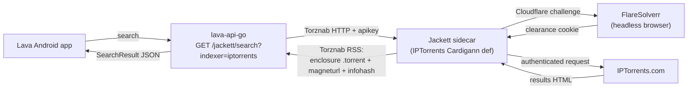

# Design: IPTorrents support (via the Jackett sidecar + FlareSolverr)

**Revision:** 1
**Last modified:** 2026-06-08T00:00:00Z
**Status:** design proposal
**Classification:** project-specific

> IPTorrents is one of the operator's 4 required trackers and is **not yet supported**. It is a
> **private English tracker behind Cloudflare**.

## 1. Why a NATIVE Kotlin provider cannot honestly support IPTorrents today

The Lava tracker SDK's providers use **OkHttp + Jsoup** (plain HTTP client + HTML parser). IPTorrents
gates every request behind **Cloudflare's JS/Turnstile challenge**, which a plain HTTP client cannot
pass — it requires a real browser engine to execute the challenge JS and obtain the clearance cookie.

Two hard consequences (stated as fact, not guess — §11.4.6):

1. **No reachable HTML to parse.** From an OkHttp client the IPTorrents pages return the Cloudflare
   interstitial, not the tracker HTML. The dossier (`docs/qa/jackett-local-stack-research.md`)
   documents FlareSolverr as the required Cloudflare-bypass for exactly this class of tracker.
2. **Parsers would be guesses.** Writing `IPTorrentsSearchParser`/`…TopicParser` without real,
   reachable fixture HTML means hand-fabricating selectors against HTML we cannot fetch — a
   **§11.4 PASS-bluff by construction** (tests would assert against invented HTML, proving nothing
   about the real site). This is forbidden.

Therefore a native provider is **not** the honest path.

## 2. Recommended path — IPTorrents via the Jackett sidecar + FlareSolverr

Jackett already ships an **IPTorrents Cardigann definition** and drives **FlareSolverr** to clear the
Cloudflare challenge. Lava already speaks Jackett's **Torznab** API via `lava-api-go`
(`internal/jackett` client + `GET /jackett/search` route, landed `05ecd014`). So IPTorrents is
reachable through the existing sidecar with **no new HTML parser**:

The app sees **one endpoint** (`lava-api-go`); Jackett + FlareSolverr + the IPTorrents credentials
all stay server-side in the local stack.

## 3. Lava-side work this needs

1. **Jackett-backed provider surface.** A `TrackerDescriptor` for IPTorrents whose data routes
   through `lava-api-go`'s Torznab proxy rather than a native HTML client. Two options:
   - (a) **Server-only**: IPTorrents exists only as a Jackett indexer; the app reaches it via the
     `/jackett/search?indexer=iptorrents` route — no Lava `core/tracker/iptorrents` module at all.
   - (b) **Thin descriptor**: a minimal `core/tracker/iptorrents` descriptor (authType=FORM_LOGIN,
     capabilities SEARCH+TORRENT_DOWNLOAD+MAGNET_LINK, `apiSupported=true`) whose `TrackerClient`
     delegates `search`/`download`/`magnet` to the Jackett route — so it appears in the provider
     list and reuses the app's existing search UI. **Recommended** for UX parity.
2. **Credentials (§6.H).** IPTorrents username/password go into **Jackett's gitignored `/config`
   volume** (where Jackett stores per-indexer creds), never into Lava source or the app. The
   operator-provided creds are already staged in the gitignored `.env`
   (`IPTORRENTS_USERNAME`/`IPTORRENTS_PASSWORD`) for the eventual Jackett-config automation.
3. **FlareSolverr profile.** Enable the `cloudflare` compose profile (`docker-compose.jackett.yml`)
   so FlareSolverr runs alongside Jackett (RAM-heavy headless Chromium — off by default, on for
   Cloudflare trackers).
4. **Per-provider verification (§6.G).** A real-stack test that, with the sidecar running, does
   `GET /jackett/search?indexer=iptorrents&q=<query>` and asserts a real result carrying a valid
   `.torrent` enclosure URL and/or `magneturl`/`infohash` — validated by the same
   `lava.common.torrent` validators / the Go Torznab parser. Honest SKIP when the sidecar isn't
   running (§11.4.3). This is the IPTorrents analogue of the rutor crown-jewel proof.

## 4. Alternative considered — native provider + embedded FlareSolverr call from Kotlin

Rejected. It would couple the Android APK (or a per-provider extension) to a running FlareSolverr
service anyway (headless browser can't ship in the APK), is heavier than the sidecar, duplicates
what Jackett already does (Cardigann def + FlareSolverr orchestration), and still cannot run
fully on-device. The sidecar path reuses Jackett's maintained IPTorrents definition and keeps the
Cloudflare complexity server-side.

## 5. Recommendation

**IPTorrents = Jackett-backed (option 3b: thin descriptor delegating to the `/jackett/search`
route), with FlareSolverr enabled.** It is the only honest, testable path (real Torznab results,
real `.torrent`/magnet, validatable evidence) given Cloudflare — and it generalizes to the other
~500 Jackett indexers for free.

## Sources verified

- `docs/qa/jackett-local-stack-research.md` (FlareSolverr required for IPTorrents' Cloudflare; GPL-2.0;
  multi-arch image).
- `lava-api-go/internal/jackett/` + `internal/handlers/v1/jackett.go` + `internal/router/router.go`
  + `internal/config/config.go` (the Torznab client + `/jackett/search` route, landed `05ecd014`).
- `tools/lava-containers/docker-compose.jackett.yml` (jackett + flaresolverr `cloudflare` profile).
- `core/tracker/api/{TrackerDescriptor,TrackerCapability,AuthType}.kt` (the descriptor surface).
